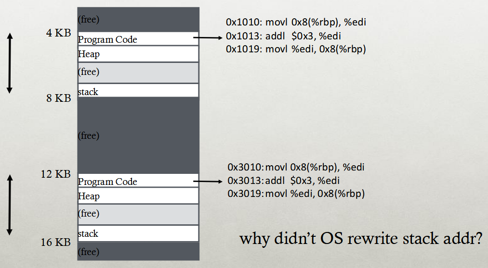
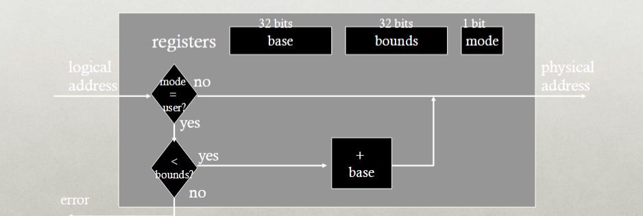
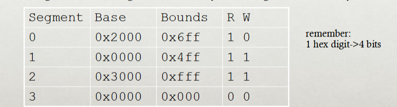
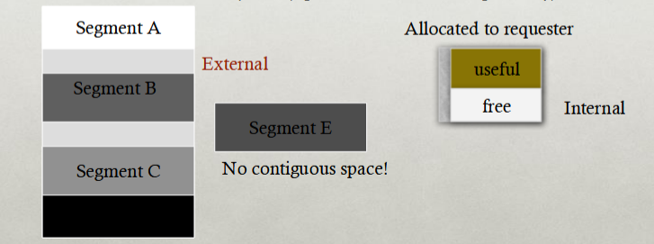
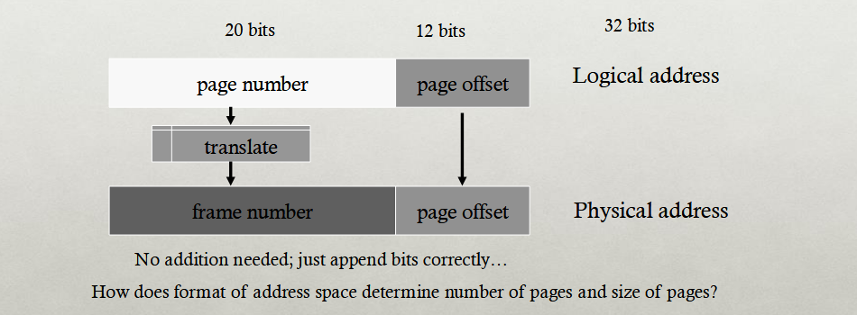
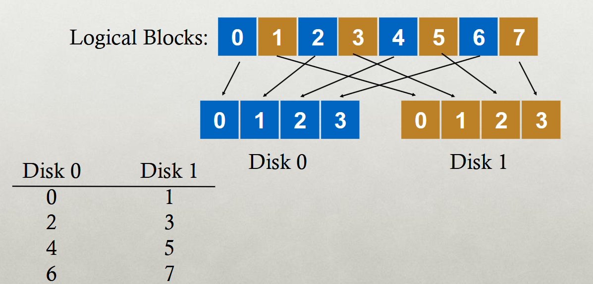


# [Finals Review](0-os-design)

- Format: 75% on material after the midterm, 25% on stuff before the midterm.
- **Virtual memory is a big portion**

## Memory Virtualization

> The overall goal of memory virtualization is to give each process the *illusion* of private memory space.

Whereas CPU Virtualization's goal is the *illusion* of private **CPU registers**, the goal of Memory Virtualization is the *illusion* of **private memory addresses.**

	Think about it as such:
	Process A: movq %rax %rdx
	Process B: movq %rdx %rcx
	This DOESN'T mean the contents of the %rax register is now in %rcx!!! (They are different processes, so each one's %rdx would contain different information)

	Same applies to memory:
	0xff1 in Process A != 0xff1 in Process B!!!

---

### Goals

#### Transparency
- Processes should not be aware that memory is being shared. (Goes back to the goal)
- There should be support for any number of processes, and regardless of where they are.

##### Protection

> Always, always, wear a -

- The process should not be able to corrupt the OS or any of the other processes.
- **Privacy:** Can not read the memory of another process.

##### Efficiency
- No waste of memory resources. (This means minimizing the amount of fragmentation)

##### Sharing
- Cooperating with other processes and sharing a portion of the address space. (If necessary)

### Memory Space Abstraction

> **Address Space:** Each process has a set of addresses that map to bytes.

- This address space has both *static* and *dynamic* components.
	- **Static**: Code and some global variables.
	- Dynamic: Stack and heap!


### Dynamic Memory Motivations

> *Variable amount of memory*

- *Why do processes need dynamic allocation of memory?*
	- Easy: You don't know the amount of memory needed at compile time.
		- So, if you allocate statically at runtime, you run into an issue where you MUST allocate for the worst case, meaning **storage is horribly inefficiently used!!!**
	- What else? **Recursive Operations!!!**
		- We love recursion ;-;
		- You don't know how many times the procedure will be nested within a recursive call.
	- **Complexed data structures:**
		- Lists and trees, they could be massive and can change in size.

> There are *two* types of dynamic allocations: **Stack and Heap**

- Stacks are used for procedure call frames such as *local variables and parameters*.

```C
main() {
	int A = 0; // Stored in stack!
	foo (A);
	printf("A: %d\n", A);
}

void foo (int Z) {
	int A = 2; // Stored in stack!!
	Z = 5;
	printf("A: %d Z: %d\n", A, Z);
}
```

#### Heaps

> Heap: Allocate from any random location using *library calls* like `malloc()` and `new()`

- Heap memory will usually consist of *allocated spaces* and *free spaces* (Damn holes)
- The order of allocation and free is unpredictable.

###### Advantage
- Heaps work for *all data structures!*

##### Disadvantages
- Allocation can be slow. 
- End with small chunks of free space. -> This is fragmentation!
	- Where would you allocate 12 bytes? 16 bytes? 24 bytes????

##### OS Role
- The OS is only in charge of giving a large chunk of free memory to processes, the libraries manage the *individual allocations*.
	- Like a rich dad giving his children money to start a business, but they decide what to do with it.

### Memory Time Sharing

> What if we try a similar approach to how the OS virtualizes the CPU?

- The OS gives the illusion of many virtual CPUs by saving CPU registers to *memory* when the process isn't running...
- Could we give the illusion of many virtual memories by saving **memory** to the **disk** when the process isn't running?


#### Problem
- This solution has a ridiculously poor performance.
- What happens if you have a massive system which has 83 gigabytes of RAM?
	- You can't write all that to the disk, that's insane.

> The better alternative to this solution would be *space sharing*

-  At the same time, space of memory is divided across the processes.

### Static Relocation

> The OS will rewrite each program *before* loading it as a process in memory.

- Each rewrite for the different process will use different addresses and pointers!
- Change jumps, loads of static data, etc...


#### Layout



#### Disadvantages
- There is no **protection!!!!**
	- Processes can just go and destroy the OS or any other processes as they wish.
	- There is no privacy. (Failed multiple of the goals of memory virtualization)
- It can not be moved after the address space has been placed....
	- What happens if you need to allocate a new process?
	- Heap should also dynamically grow with the memory...

### Dynamic Relocation

> Dynamic relocation aims to protect each process from one another. (*Requires hardware support*)

- Dynamic Relocation uses a MMU (Memory Management Unit) to *dynamically* change the process address at every memory reference.
	- Each process will generate a *logical / virtual* address within their address space.
	- The MMU will take this *logical / virtual* address and translate it.
	- The actual memory hardware will use *real / physical* addresses.


#### Hardware Support

- There are two operating modes for dynamic relocation:
	- *Privileged (Protected, kernel) mode* (White mode)
		- The OS will run in this mode. (Entering the OS through *traps, system calls, interrupts, exceptions*)
		- Allows for certain instructions to be executed.
			- Here, the contents of the MMU can be manipulated.
		- Allows OS to access all of the physical memory.
	- *User mode* (Minority mode)
		- Perform translation of logical addresses to physical address.
		- (*Important note*) The translation is performed in *user mode*, not privileged mode.

Minimal MMU contains **base register** for translations.

- This `base` is the start location for the address space.

#### Dynamic Relocation BASE REG

> This is the translation on every memory access of the user process.

- The MMU adds base register value to the logical address in order to form the physical address.
- Super simple calculation.


The idea is simply to translate the virtual address into a physical address by adding a fixed offset each time.

- This offset will be stored in the base register, and will be different for each process.
 


##### Problems
- **PROTECTIONNNNNNN**
	- THERE IS. NO. PROTECTION????
	- DAWG U CAN TOUCH OTHER PROCESSES WITHOUT ASKING.

#### Dynamic Relocation BASE+BOUNDS

> Limit the address space by adding a *bounds register*

- The base register will contain the smallest physical address (The starting location)
- The bounds register will contain the size of the process's virtual address space.
	- Sometimes can be defined as the largest physical address. (Base + size)
- The OS will kill the process if it loads/stores beyond the boundary.



- Pretty simple to understand.
- It's just an extra step added where another register stores the bounds information as compared to base.


##### Managing Processes w/BASE+BOUNDS
- Context-switch
	- Add base+bound registers to PCB.
	- Steps:
		- Change to privileged mode.
		- Save Base+bounds registers of old process.
		- Load Base+bounds registers of new process.
		- Change to user mode and jump to new process.
- **What if don't change** Base+bounds registers when switch?
- Protection requirement
	- User process cannot change Base+bounds registers.
	- User process cannot change to privilege mode.


##### Advantages

- Provides protection (both reading and writing) across the address spaces.
- Supports dynamic relocation!
	- Can place process at different locations than initially and also move the address space.
- It's also simple and inexpensive to implement.
	- Only takes a few registers and a little logic in the MMU.
- FAST
	- Add and compare in parallel.

##### Disadvantages

- Each process must be allocated contiguously in the physical memory...
	- Must allocate memory that may not be used by the process. (In order to remain within bounds.)
- This means there is also no partial sharing: You can not share limited parts of the address space. (OS will kill you.)

### Segmentation

> Divide up the address space into its own logical segments.

- Each segment will correspond to a logical entity in address space.
		- So, the *code*, the *stack* and the *heap* will all be **separate segments**.
- Each segment will be able to independently:
	- Be placed separately in physical memory.
	- Grow and shrink!
	- Be protected (Separate read/write/execute protection bits)

#### Segmented Addressing

> The process will now specify the segment and offset within the segment.

- How does the process designate a particular segment?
	- The process will use part of the logical address.
		- Top bits of the logical address select the segment.
		- Low bits will select the offset within the segment.
- What happens if it's a small address space, and there are not enough bits?
	- Implicitly by type of memory reference.
	- Special registers.

#### Segmentation Implementation

- The MMU will contain a Segment Table for each process.
	- Each segment will have it's own BASE+BOUNDS and protection bits.



##### Segmentation Example


#### Advantages of Segmentation
- Enables sparse allocation of address space.
	- Stack and heap can grow independently.
	- Heap: if no data on free list, dynamic memory allocator requests more from OS (e.g. UNIX: malloc calls `sbrk()`)
	- Stack: OS recognizes reference outside legal segment, extends stack implicitly.
- Different protection for different segments.
	- Read-only status for code.
- Enables sharing of selected segments.
- Supports dynamic relocation of each segment.

#### Disadvantages of Segmentation
- Each segment must be allocated contiguously.
	- May not have sufficient physical memory for large segments.

### Fragmentation

> Fragmentation is when free memory can't be usefully allocated.

- Why does this happen?
	- Free memory (holes) are too small and scattered about.
	- Rules for allocating memory prohibit using this free space.
- Types of Fragmentation: (**IMPORTANT**)
	- External: Visible to the allocator (e.g. OS)
	- Internal: Visible to requesters (e.g. if must allocate at some granularity)



---

> Note: As Paging is such an important portion, it will have it's own dedicated section

---

## Paging

> Dividing up the address space and physical memory into fixed-sized *pages*.

- **Goal**: Eliminate the requirement for contiguous address space.
	- This will eliminate any external fragmentation.
	- Allow the segments to grow as needed.


### Translation

- How to translate logical address to physical address?
	- High order bits of address designate page number.
	- Low-order bits of address designate offset within page.
- **How does** format of address space determine number of pages and size of pages?
	- Figure out how many bits you need to locate all the addresses on the page.



#### Virtual to Physical Page Mapping

- How should the OS translate the VPN (Virtual Page Number) to the PPN (Physical page number)?
- For segmentation, a formula was used. (`BASE`)
- For paging, OS needs a more general mapping mechanism...


### Page Tables

> Basically a big array containing the locations of the different page mappings.

##### Page Table Size

	Pages are typically 4KB
	Entries are 4 bytes

- The page table size is the *number of entries* \* the *size of each entry*.
- The Number of entries would be the number of virtual pages, which is decided by the amount of bits for the VPN. (2^VPN bits)
- Bits for VPN are decided as Address space (Ex: 32-bit address spaces would be 32...) - the page offset bits
	- The number of page entries would then be 2^(32-12) (assuming 4 KB pages)
	- Page Table size would then be: # of entries (2^20) \* size of each entry (4 bytes) = 4MB.

#### Storing Page Tables

> Also stored in the memory.

- The hardware will find the page table base with a register.
- When context-switching, change the contents of the page table base register to newly scheduled process.
- Save the old page table base register in the *Process control block* of descheduled process.

---

> NOTE: Page Tables are *slooooooow*, they double the number of memory references you need.

To get the physical address of a virtual address like `Oxfff000`, you need to first access the page table, find the translation to the PPN, and *then* you can add the offset on to find the address.

---
##### Advantages of Paging

- There is no external fragmentation.
	- As the pages are divided up into explicit sizes, the pages can be placed in any frame in physical memory.
- Fast to allocate and free.
	- *Alloc*: There is no need to search for suitable free space.
	- *Free*: Doesn't have to coalesce adjacent free spaces since it's all pages.
	- **Use bitmap** to show the freed or allocated page frames. (*This is what makes it fast!!!*)
- It is simple to swap-out portions of memory to the disk.
	- As the page size matches the disk block size...
	- You can run processes when some pages for the process are on disk.
		- *Adding a "present" bit to the PTE*


##### Disadvantages of Paging

- Internal fragmentation
	- Page sizes may not match the size needed by the process. (You waste memory, especially with larger page sizes)
- Additional memory reference to page table.
	- The page table is also stored in memory....
		- The MMU only stores the base address of the page table, meaning you need to find the translation and access the data there.
	- As mentioned earlier, *you double* the memory references.
- The storage for page tables may be substantial.
	- Simple page table: Requires PTE for all pages in the address space.
		- Entry is still needed even if the page is not allocated.
	- Problematic with dynamic stack and heap within address space.
	- Page tables also must be allocated contiguously in memory.

### Multilevel Page Tables

> Multilevel page tables split up page tables into *different levels.*

- **Goal:** Allowing each page table to be allocated non-contiguously.
- **Idea:** Page the page tables.
	- Create multiple levels of page tables, with the outermost level being called the "**Page directory**"
	- Only allocate page tables for pages in use.


- The multilevel page table uses a *radix tree* data structure.
	- Keys combine together from the different nodes in the tree.
- Each entry in the outer page tables point toward another entry in a *inner page*.
	- The *inner page* will have entries that point toward the actual physical page location of the data.
	- This is why the virtual address is now further divided.
- **Representation bits** for the page tables can be *smaller* but can NOT be *bigger* than the size of each table.

#### Address Format for Multilevel Paging

	Given a 30-bit address, 4KB page size, 4 byte entries.

- How should the logical address be structured?
	- How many bits for each paging level?
- **The goal is to fit each page table within a single page!!**
	- `4KB page size = 12 bits for offset.`
	- `4KB page size / 4 byte entry = 1024 entries`
	- `1024 entries is 1KB or 2^10`, we need 10 bits for the inner page.
	- `30 - 10 - 12 = 8`, we have 8 bytes left for the outer page directory.

##### Problems with 2 Levels

	What happens if you have a 64-bit address? 
	Maintaining 4KB page size and 4 byte entries.
	
- `4KB page size = 2^12 bit offset`
- `4KB / 4 bytes per entry means 1024 entries for inner page`
- `64 - 10 - 12 = 42 bits for outer directory?`
- `2^42 is 4.3980465e+12 PAGE TABLES!!!!`

Solution:

- Split the page directory into more pieces!
- Use another page directory to refer to the page directory pieces.


	How large is virtual address space with 4 KB pages, 4 byte PTEs, each page table fits in pages given 1, 2, 3 levels?
	4 KB / 4 Bytes -> 1 K entries per level.
	1 level: 1 K * 4K = 2^22 ~ 4 MB
	2 levels: 1 K * 1K * 4K = 2^32 ~ 4 GB
	3 levels: 1 K * 1K * 1K * 4K = 2^42 ~ 4 TB

> *Side Note:* Current systems have 4 levels of page tables, but they only use 48 bits of the page table.

### Paging and Segmentation

> Segmented memory, then take the portions and divvy them into pages.

- Divide the address space into different segments (code, heap, stack)
	- These segments can be of variable length.
- Then, divide each segment into fixed size pages.
- Logical address will now be divided into three portions!


#### Implementation

- Each segment has a page table.
- Each segment track will track the base (physical address)  and bounds of the *page table* for that segment.

##### Implementation Practice


#### Advantages of Paging and Segmentation

> Combines the advantages of both Segments and Pages

- Advantages of Segments
	- Supports sparse address spaces.
	- Decreases the size of page tables.
	- If the segment is not being used, there's no need for a page table.
- Advantages of pages
	- No external fragmentation.
	- Segments are allowed to grow without reshuffling
	- Can run process when some pages are swapped to disk.
- Advantages of Both
	- Increases flexibility of sharing.
	- You can either share one single page or entire segment.

#### Disadvantages

- Potentially large page tables (for each segment)
	- Must allocate each page table contiguously.
	- More problematic with more address bits.
- Page table size?
	- Assume 2 bits for segment, 18 bits for page number, 12 bits for offset.

---

	Each page table is:
	 = Number of entries * size of each entry
	 = Number of pages * 4 bytes
	 = 2^18 * 4 bytes = 2^20 bytes = 1 MB

---

### Translation Lookaside Buffer

> A caching system for storing page translations.


- The TLB (Translation lookaside buffer) is an address cache inside the CPU.
- It *only stores translation addresses*
- It's purpose is to mitigate some of the expenses of repeatedly accessing similar pages by keeping that address in the TLB.

#### TLB Organization


##### Associative cs Direct Mapped


##### Set Associative Cache

- There are multiple addresses that may be mapped to the same cache when using a *directly mapped cache.*
- Set associative TLBs try to mitigate this issue a little.
- Ex: Kick out the one that was *least recently used*.

##### Associativity Tradeoffs

- *Higher associativity*
	- Less of a chance of collisions for mapping to the same location in the cache.
	- However: *Slower in implementation* and *needs more hardware*
- *Lower associativity*
	- Fast and simple, *less hardware needed*
	- However: Greater chance of collisions.

> **Note:** Typically, TLBs are fully associative.

###### Sequential TLB Accessing Example


#### TLB Performance

> Calculating the miss rate of TLB for data is simple: `# of TLB misses / # TLB lookups`

Example:

```c
int sum = 0;
fopr(int i = 0; i < 2048; i++) {
	sum += a[i];
}
```

	In this example...
	Total TLB lookups will be: 2048
	Total Misses: 2 (Once when i = 0, and another time when i = 1024)
		Or, think about it as the number of unique pages accessed:
		2048 / (elements of 'a' per 4K page)
		= 2K / (4K / sizeof(int)) = 2K / 1K
		= 2
	This means:
		Miss rate: 2/2048 = 0.1%
		Hit Rate: (1 - miss rate) 2046/2048 = 99.9%

> **Note:** Hit rates will get **WORSE** will smaller pages. (You need to check more unique pages)

---

- How can system improve TL performance (Hit rate) given fixed number of TLB entries?
	- **Increase page size:**
		- Fewer unique page translations needed to access same amount of memory.
- **TLB reach:** `Number of TLB entries \* Page size`

---

##### TLB Performance with Workloads

- Sequential array access will *almost always* hit in the TLB, making it fast af.
- A slower access pattern would involve highly random accesses, with **no repeated accesses**.
	- This gives the cache no purpose.


##### Workload Locality

- **Spatial Locality:** Future access will be to a nearby address.
- **Temporal Locality:** Future access will repeat to the same exact data.
- What TLB characteristics are best for each type?
	- *Spatial:*
		- Since the same page is used repeatedly, we need the same VPN to PPN translation.
		- The same exact TLB entry is used.
	- *Temporal:*
		- Accessing the same address in the near future.
		- The same TLB entry will be used in the near future again.
			- How near is this "future"? (Not the rapper)
			- How many TLB entries are there???

### Memory Policy

> The goal of our memory policies is to minimize the number of page faults.

- Page faults require milliseconds to handle the reading from disk.
	- Compare this to just nanoseconds for memory accesses.
- Implication: Plenty of time for OS to make a good decision as to where to store the page.

The OS has TWO decisions to make:

- Page selection
	- *When* should a page (or pages) be brought into memory?
- Page replacement
	- *Which* page gets thrown out of memory and back into *disk*?

> Our memory policies should rely on *locality of reference*.

#### Locality of Reference

- We can leverage the *locality of reference* within processes.
	- *Spatial*: Referencing memory addresses **near** previously referenced addresses.
	- *Temporal*: Referencing memory addresses that have been referenced in the past.
- We will use the fact that Processes spend the *majority* of their time in only a small portion of the code.
	- Estimated to be around 90% of time in just 10% of code.
- Since processes only use small amounts of address space at any time...
- We only need a small amount of address space in physical memory.

#### Memory Hierarchy


#### Virtual Address Space Mechanisms

- Each page in virtual address space will map to one of three locations:
	- Physical main memory: Small, fast, but expensive.
	- Disk (Backing store): Large, slow, but cheap.
	- Nothing (error): Free page.
- To account for storing in disk, we extend the page tables with an extra bit: `present`
	- `permissions (r/w)`, `valid`, `present`
	- Page in memory: `present` bit is set in the PTE.
	- Page on disk: `present` bit is cleared.
		- The PTE will then point to where the block on disk is.
		- Will trap into OS when page is referenced. This trap is a **page fault**.


##### Translation Steps

> The hardware and the OS will cooperate to translate the addresses.

1. Hardware checks the TLB for the virtual address.
	- If the TLB hits, address translation is done, the page is in the physical memory.
2. If TLB misses, OS walks the page tables.
	- If the PTE for the page has its `present` bit set, then page is in physical memory.
3. If **page fault** (when `present` bit is cleared)
	- Trap into OS (not handled by the hardware)
	- OS selects a victim page in memory to replace.
		- Write victim page out to disk if modified.... (need another bit: `dirty`)
	- OS reads referenced page from disk into memory.
	- Page table is updated, `present` bit is set, process can continue execution.

---

#### Average Memory Access Time

> AMAT for short.

	Hit % = portion of access that goes straight to RAM.
	Miss % = portion of accesses that go to disk first.
	Tm = Time for memory access.
	Td = Time for disk access.

`AMAT = (Hit% * Tm) + (Miss% * Td)`

---
#### Page Selection

- **Demand paging:** Load the page only when a page fault occurs.
	- When process starts: No pages are loaded into memory.
	- Problem: Pay the cost of page fault for every newly accessed page.
- **Prepaging:** (Anticipatory, prefetching) Load the page before referenced.
	- Have the OS predict future accesses (*oracle*) and bring pages into memory early.
	- Works well for some access patterns (e.g. sequential access)
	- Problems: May lead to *thrashing*, where the system is constantly paging, spending too long page faulting for pages it doesn't need.
- You can combine prepaging with user supplied hints about page references...
	- "Maybe i'll need this in the future", "don't need this one anymore", sequential access here... etc...
	- Example: `madvise()` in Unix.

### Page Replacement

> Which page in the main memory should be selected as the victim to be evicted?

- Write out the victim page to disk if modified (dirty bit set)
- If victim page is not modified (clean), just discard.

#### OPT

> Replace the page that won't be used for the longest time in the *future*.

- Advantages: Guaranteed to minimize the number of page faults that occur.
- Disadvantages: Requires the OS to predict the future. (Future sight!)
	- Not very practical but a good comparison.

##### OPT Example


#### FIFO

> Replace the pages that have been in memory for the longest. (First one in, first one out)

- The reasoning for this approach is, maybe the first page has been accessed a long time ago, so we're done with it now.
- Advantages: Fair, all pages receive equal residency.
	- Also very easy to implement with a circular buffer.
- Disadvantages: Some pages may always be needed.


#### LRU

> Replace the page that has been *least recently used*.

- The reasoning here is because of the disadvantage of FIFO, if some pages are always needed, we'll just evict the one that hasn't been accessed for the longest time!
- Problem: Does not consider the frequency of accesses.


##### Implementing LRU

- Software perfect LRU
	- OS will maintain a ordered list of physical pages by the reference time.
	- When a page is referenced: Move the page to the front of the list.
	- When a page needs to be evicted: Pick page at the back of the list.
	- Trade-off: Slow on memory reference, fast on replacement.
- Hardware Perfect LRU
	- Associate timestamp register with each page.
	- When page is referenced: Store the system clock in register.
	- When a page needs to be evicted: Scan through registers to find the oldest clock.
	- Trade-off: Fast on memory references, slow on replacement. (esp. as the memory size grows)

> In practice, do not implement a perfect LRU.

- LRU is an approximation anyways, so just approximate some more.
- Goal: Find an old page, but not necessarily the oldest.

#### Page Replacement Comparison

> What happens when we add more physical memory? How does that impact performance?

- LRU, OPT: Adding more memory will guarantee fewer to same number of page faults.
	- Smaller memory sizes are guaranteed to contain a subset of larger memory sizes.
	- Stack property: Smaller cache always subset of bigger.
- FIFO: Add more memory, *usually* have fewer page faults.
	- **Belady's Anomaly**: May actually have *more* page faults!!!

Consider the following example:

	Consider access stream: 1, 2, 3, 4, 1, 2, 5, 1, 2, 3, 4, 5
	Consider physical memory sizes: 3 pages vs 4 pages
	How many misses with FIFO?
	3 Pages = 9 misses.
	4 Pages = 10 misses.

#### Clock Algorithm

> A *clock hand* that traverses the physical memory, looking for a page with it's `use` bit cleared.

- In hardware:
	- Keep a `use` (or `reference`)  bit for each page frame.
	- When the page is referenced, set the `use` bit.
- In the OS:
	- Page replacement: Look for a page with `use` bit cleared. (Has not been referenced in a while)

**Implementation**

- Keep pointer to last examined page frame.
- Traverse pages in circular buffer.
- Clear `use` bits as search continues.
- Stop when you find a page with already cleared `use` bit, replace this page.


##### Small Clock Extensions

- Replace multiple pages at the same time
	- Since it's expensive to run the replacement algorithm and to write single block to disk, find multiple victims each time and track free list.
- Add software counter (`chance`)
	- To better differentiate between the page accesses.
	- Increment a software counter if `use` bit is 0.
	- Replace when the chance exceeds some specified limit.
- Use dirty bit to give preference to dirty pages.
	- Since it's more expensive to replace dirty pages, we'll skip those for now.
		- Dirty pages *must* be written to disk, clean pages can just be discarded.
	- Replace the pages that have both `use` bit and `dirty` bit cleared.

## File Systems

> A structure to help map files to disk blocks.

A similarity to memory?

- Same principle: Map logical abstractions to a physical resource.

### Some Allocation Strategies

- There are multiple different allocation methods for File systems, some which work better than others.
- Questions to consider:
	- Fragmentation? How much internal and external fragmentation of disk space does this lead to?
	- Is there an ability to grow the file? How easy is it to do that?
	- Performance of sequential accesses (How contiguous is the layout)?
	- Speed to find data blocks for random accesses?
	- Wasted space for metadata overhead?
- Each of the different methods has it's own ups and downs to consider...

#### Contiguous Allocation

> Allocate each file to a contiguous sector on the disk.

- Metadata: Starting block and the size of the file
- OS allocates by finding sufficient free space.
	- Must predict the future size of the file, reserve the space.


- Fragmentation: (`-`) Horrible external fragmentation (Since you must find a big enough space.)
- Ability to grow file: (`-`) May not be able to without moving the file.
- Seek cost for sequential accesses: (`+`) Excellent performance.
- Speed to calculate random accesses: (`+`) Simple to calculate
- Wasted space for metadata: (`+`) Little metadata overhead

#### Small Number of Extents

> Building off Contiguous allocation by allocating *multiple* contiguous segments per file.

- Metadata: A small array designating the size of each extent.
	- Each entry will contain the starting block and size.


- Fragmentation: (`-`) Helps the external fragmentation.
- Ability to grow file: (`-`) Overall still bad because it can only grow until you run out of extents.
- Seek cost for sequential accesses: (`+`) Still good performance.
- Speed to calculate random accesses: (`+`) Still simple calculations.
- Wasted space for metadata: (`+`) Larger overhead than before, but still small overhead.

#### Linked Allocation

> Allocate linked list of *fixed-sized* blocks (Multiple sectors)

- Metadata: Location to the first block of file.
	- Each block will also contain pointers to the next block in the linked allocation.


- Fragmentation: (`+`) No external fragmentation (You can use any block), no internal fragmentation, once block is full, get the next one.
- Ability to grow file: (`+`) Can grow very easily.
- Seek cost for Sequential Access: (`+/-`) Depends on the data layout.
- Speed to calculate random accesses: (`-`) Ridiculously poor.
- Wasted space for metadata: (`-`) Waste a pointer for every single block the file needs.

> Tradeoff here is that the block size does not need to equal the sector size!

#### File Allocation Table (FAT)

> A variation of Linked allocation which also stores the linked list information for all files in a on-disk FAT table.

- Metadata: Location of first block of the file and the FAT table itself.


- Same basic advantages and disadvantages as linked allocation.
- Extra Disadvantage: Reading from two disk locations for every data read. (FAT table + actual disk location)
- Optimization: Caching the FAT in main memory.
	- Advantage: Greatly improves the random accesses speed.
	- However, what portions should be cached? Does this scale with larger file systems?

#### Indexed Allocation

> Allocate fixed-sized blocks for each file.

- Metadata: Fixed-sized array of block pointers.
- Allocate space for pointers at file creation time.


- Fragmentation: (`+`) No external fragmentation.
- Ability to grow file: (`+`) Files can be easily grown up to a max file size.
- Sequential Access: (`+`) Fast sequential accessing.
- Random accessing: (`+`) Supports that too.
- Overhead for metadata: (`-`) Large wasted overhead for pointers that are unneeded. (Most files are small)

### Multilevel Indexing

> A variation of Indexed allocation that dynamically allocates hierarchy of pointer to blocks as needed.

- Metadata: Small number of pointers that are allocated statically.
	- Additional pointers can be allocated if needed that point to blocks of pointers.


- **Advantage:** Does not waste space for unneeded pointers.
	- Still fast access for small files.
	- Can grow to what size??
- **Disadvantages:** Need to read indirect blocks of pointers to calculate addresses. (extra disk read)
	- Keep indirect blocks cached in main memory.

Multilevel indexing supports a *flexible number of Extents*

#### Flexible Number of Extents

> Dynamically allocate multiple contiguous regions (extents) per file.

- Organize extents into multilevel tree structure.
	- Each leaf node: starting block and contiguous size.
	- Minimize the metadata overhead when there are a few extents.
	- Allows growth beyond fixed number of extents.

- Fragmentation: (`+`) Both are reasonable.
- Ability to grow File: (`+`) Can grow.
- Seek cost for sequential accesses: (`+`) Still good performance.
- Speed to calculate random accesses: (`+/-`) Depends of the size, some calculations still needed.
- Wasted space for metadata: (`+`) Relatively small overhead.

---

### On Disk Structures

#### Data Blocks

> Everything on the disk is a data block.

- You can think about it like the 3rd project, where we have a bunch of blocks (pages), and some of them at the start store information about the other blocks (pages).


#### Inodes

> Inodes contain all the information about the block. (Metadata)

- Every inode is structured the same way, whether its for a directory, subdirectory or file.
	- Everything has a inode too!
- Inodes are also stored in order `0-....`, which also refers to their inode number.
	- Ex: Inode number `32`, calculate the offset into the inode region (`32 * sizeof(inode) (256 bytes) = 8192`), then add the start address of the inode region: `8192 + 3 * 4KB = 20 KB`
- In the disk, there will be some blocks reserved for inode blocks, blocks who's main purpose is just to store inodes. It looks like as follows:


> Each inode block will typically be `256` bytes, but depending on the FS, maybe `128`.

This means, with a typical 4KB disk block: `16` inodes per inode block.


##### Inode Metadata

```C
struct inode {
	uint16_t	ino;				/* inode number */
	uint16_t	valid;				/* validity of the inode */
	uint32_t	size;				/* size of the file */
	uint32_t	type;				/* type of the file */
	uint32_t	link;				/* link count */
	int			direct_ptr[16];		/* direct pointer to data block */
	int			indirect_ptr[8];	/* indirect pointer to data block */
	struct stat	vstat;				/* inode stat */
}
```

##### Direct vs Indirect Pointers

> In order to optimize for small and large files, we need a mixture of direct and indirect pointers to data blocks in the inode.

- A **direct pointer** in an inode points directly to a physical block in the memory.
	- A inode structure will have 16 direct pointers.
- An **indirect pointer** may point to a physical block, but each entry in the physical block may point to another physical block of memory.
	- This allows you to have double, or even triple indirect pointers.


#### Directories

- Commonly store directory entries in data blocks.
- Large directories will just use multiple data blocks.
- Use bit in the inode to distinguish directories from files. (`type`)

##### Simple Directory Example


#### Bitmaps

> For easy way to locate a free data block or free inode.

- Store a bitmap block for the inodes and for the data.
- Think about the project.


#### Superblock

> This will be the first block of the entire FS, and store configurations metadata.

- Will allow you to know the block sizes, # of inodes, and the calculations of where each section starts.

```C
struct superblock {
	uint32_t	magic_num;			/* magic number */
	uint16_t	max_inum;			/* maximum inode number */
	uint16_t	max_dnum;			/* maximum data block number */
	uint32_t	i_bitmap_blk;		/* start block of inode bitmap */
	uint32_t	d_bitmap_blk;		/* start block of data block bitmap */
	uint32_t	i_start_blk;		/* start block of inode region */
	uint32_t	d_start_blk;		/* start block of data block region */
}
```

### File System Operations

#### Create File

> `create /foo/bar`

| data bmap | inode bmap | root inode | foo inode | foo inode | bar inode | root data | foo data |
| --------- | ---------- | ---------- | --------- | --------- | --------- | --------- | :------- |
|           |            | 1. read    |           |           |           |           |          |
|           |            |            |           |           |           | 2. read   |          |
|           |            |            | 3. read   |           |           |           |          |
|           |            |            |           |           |           |           | 4. read  |
|           | 5. read    |            |           |           |           |           |          |
|           | 6. write   |            |           |           |           |           |          |
|           |            |            |           |           |           |           | 7. write |
|           |            |            |           |           | 8. read   |           |          |
|           |            |            |           |           | 9. write  |           |          |
|           |            |            |           | 10. write |           |           |          |


1. Go to the `root` inode, read the contents of the root inode.
2. Find all and read all the data blocks for the root inode. 
3. Read `foo` inode, going to its data block.
4. Read it's data to see if the `bar` file already exists or not. If not...
5. Read the bmap to find a free inode in the bitmap.
6. Immediately write to it and reserve the `inode` so it can't be stolen.
7. Write the data for foo.
8. Every time file gets created, you need to read the `inode` to update the file creation time.
9. Update the file creation time.
10. Write the number of links to the foo inode.

#### Opening Files

> `open /foo/bar`


| data bmap | inode bmap | root inode | foo inode | bar inode | root data | foo data | bar data |
| --------- | ---------- | ---------- | --------- | --------- | --------- | -------- | -------- |
|           |            | 1. read    |           |           |           |          |          |
|           |            |            |           |           | 2. read   |          |          |
|           |            |            | 3. read   |           |           |          |          |
|           |            |            |           |           |           | 4. read  |          |
|           |            |            |           | 5. read   |           |          |          |

- The first step to opening a file is *checking that the file exists*.

#### Writing To Files

> `write to /foo/bar`

(*All assuming that the file exists and has been opened*)

| data bmap | inode bmap | root inode | foo inode | bar inode | root data | foo data | bar data |
| --------- | ---------- | ---------- | --------- | --------- | --------- | -------- | -------- |
|           |            |            |           | 1. read   |           |          |          |
| 2. read   |            |            |           |           |           |          |          |
| 3. write  |            |            |           |           |           |          |          |
|           |            |            |           |           |           |          | 4. write |
|           |            |            |           | 5. write  |           |          |          |

1. Read `bar`'s inode, because it contains the info on where the blocks for `bar` are.
2. Read the data bitmap to find out where is the next *free* data block that is available.
3. Convert the bitmap and reserve it, **same reason** as when creating.
4. Write the contents of what we want to write directly to the data block.
	- Otherwise, if you point `bar`'s inode to the data block before writing, your file will point to corrupted data and and also wastes a block. (If the system crashes)
	- In the optimal scenario, we only waste a data block, but we don't point our `bar` inode to a corrupted block.
1. Actually write the inode to point to the data.

#### Reading a File

> `read /foo/bar`

| data bmap | inode bmap | root inode | foo inode | bar inode | root data | foo data | bar data |
| --------- | ---------- | ---------- | --------- | --------- | --------- | -------- | -------- |
|           |            |            |           | 1. read   |           |          |          |
|           |            |            |           |           |           |          | 2. read  |
|           |            |            |           | 3. write  |           |          |          |

3. For the access time, in order to update it.

#### Efficiency

- How can we avoid excessive I/O for basic operations?
	- Like all good answers in OS, add a cache.
- **Write buffering**
	- Procrastinate the process.
	- This helps to overwrites, deletes, and scheduling.

## RAID

> RAID stands for "*Redundant Array of Inexpensive Disks*", and is a method to increase capacity of disks whilst maintaining reliability and performance.

### RAID Strategies

#### Mapping

> Build fast, large disks from smaller ones.


#### Redundancy

> Add more disks for reliability purposes.


#### Tradeoffs

> Like all good things in OS...

- There are tradeoffs to each approach. In return for *reliability*, and maybe performance, you have *increased* the number of copies, but now you need multiple times more disk space.
- Or, you decrease the number of copies, which improves the *space efficiency*.

---

> **Note:** Some standards

- *Throughput*: Number of I/O Operations complete per second.
- `2f-1`: The industry standard number of copies of data, where `f` is the "failures" in the system.

---

### Metrics

- Capacity: How much space can apps use?
- Reliability: How many disks can we safely lose?
	- Assuming fail stop!
- Performance: How long does each workload take?

> Normalize each to characteristics of one disk.

	N := Number of disks
	C := Capacity of disks #todo finish filling this in
	S := Sequential throughout of 1 disk
	R := Random throughput of 1 disk
	D := latency of one small I/O operation

### RAID0 Striping

> Optimized completely for maximum capacity, no redundancy.



- The reason for the zigzag pattern of mapping is to be able to read and write in parallel.
- Ex: If your disk allows you to read two blocks concurrently, and your application would like to access blocks 0-3, you would need to issue 2 read requests.
	- Whereas for striping, you only need 1 request, as each one would be able to read 2 blocks.

#### Four Disk Striping


Given a logical address A, it is easy to find the block location of it:

	Disk = A % disk_count
	Offset = A / disk_count

*Variations:*

- Changing the chunk size of the stripes...


#### RAID0 Analysis

- What is the capacity? `N*C`
- How many disks can fail? `0`
- Latency: `D`
- Throughput (Sequential, random)? `N*S`, `N*R`
	- Buying more disks improves throughput, but not latency!!

### RAID1 Mirroring

> Keep two copies of the data at all times.


- For every disk, use one disk as a mirror for the other one.

#### RAID1 Layout


- How many disks can fail in a 4 disk RAID1 setup? Best case: `2`

#### RAID1 Analysis

- What is the capacity: `N/2 * C`
- How many disks can fail: `1 or N/2`
- Latency (read, write)? `D` 
	- (Only D because it is the same value mirrored)
	- RAID4 requires 2D for write because of the calculation necessary for the next write.
- Throughput:
	- Sequential Read: `N*S`
	- Sequential Write: `(N/2)*S`
	- Random read: `N*R`
	- Random write: `(N/2)*R` (Synchronization costs)
		- You can not go and write something else to a mirroring disk, the throughput of that disk **must** be used to mirror the write of another disk.

#### Crashes

- What happens if a crash occurs before the changes get mirrored on the other disk?
- When two requests are made, there is no telling which one gets executed first?
- *RAID1* can not account for this.

##### Solution

- Problem: Consistent-update problem
- Use non-volatile RAM in RAID controller.
- Software RAID controllers (e.g. Linux md) don't have this option.

> *Million dollar solution lol*

### RAID4 Parity

> Using a parity disk, you can restore some data.

- Use a disk as a parity disk which stores some calculated variables from all the other disks.
	- If one disk fails, you can use the parity values from this disk to regenerate the data.
- In algebra, if an equation has `N` variables, and `N-1` are known, you can often solve for the unknown.
	- So basically, if there are `N` disks, you can recover the failure of one disk with the `N-1` disks.

#### Example

> Simple additive parity.


#### RAID4 Analysis

- What is the capacity? `(N-1)*C` (1 to store parity)
- How many disks can fail? `1`
- Latency? (Read, write) Read: `D` Write: `2D`
	- Write costs more because you must write to the parity disk.
- Throughput:
	- Sequential read: `(N-1)*S`
	- Sequential write: `(N-1)*S`
		- During sequential writes, the parity block gets changed too because of striping.
	- Random read: `(N-1)*R`
	- Random write: `R/2`
		- Because you need to read and write the parity block too.
		- You must wait for one random write (to a block) to finish and change the parity BEFORE you can write to another disk.
		- (The parity IS **ALSO** a disk, which only takes in 1 write at a time!!!)

#### Crashes

- If the system crashes, the disk that failed will be marked and using the parity/the other disks, you can recalculate the missing data.

### RAID5 Distributed Parity

> Built off of RAID 4. Rotate the parity across different disks.


#### RAID5 Analysis

- Capacity: `(N-1)*C`
- How many disks can fail? `1`
- Latency (read, write)? R: `D`, W: `2*D` (You need to read and write the parity disk as well.)
- Throughput:
	- Sequential Reads: `(N-1) * S`
	- Sequential Writes: `(N-1) * S`
	- Random Reads: `N * R`
	- Random Writes: `N * R/4`


Good luck on the exam. You got this, remember the FOOD AFTER!!!