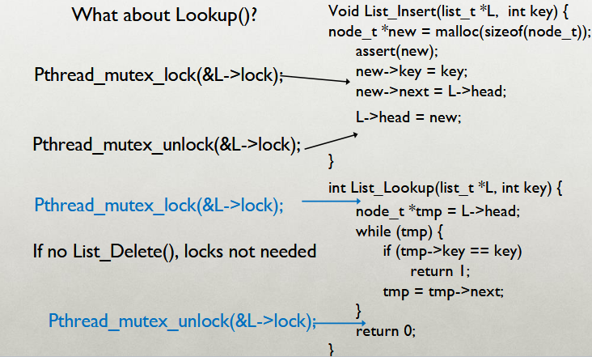
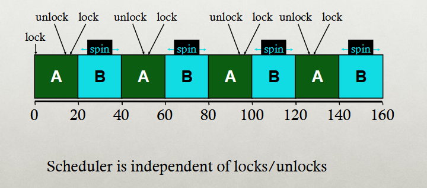
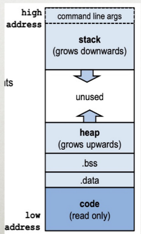
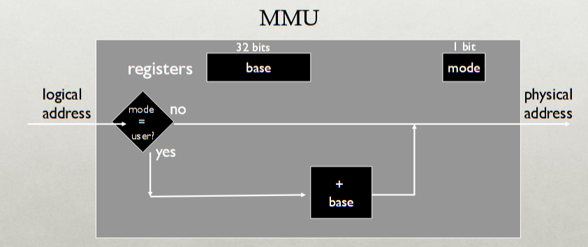

# Midterm Review

## CPU Virtualization

### Idea

- The Goal of CPU Virtualization is to give each process the *belief* that it is alone in the system.
- Each of the process will be able to share the same CPU and resources without affecting another process.
- Want to provide good CPU performance whilst keeping the system safe.
	- **That's why we don't want direct execution**.
		- This is where processes run directly on the CPU.
		- OS creates process and transfers control over to the starting point.

#### Dispatch Mechanism
- *Dispatch loop*
	- The dispatcher runs in an infinite loop, scheduling the next process to be run from some sort of queue.
	- Run process A for some time-slice, save context, switch to process B.
- **Cooperative vs True Multitasking**
	- Cooperative multitasking involves the OS waiting for the process to relinquish CPU control willingly through the use of a `yield` or `exit` statement.
		- However, this can lead to issues of the process not relinquishing control, running infinitely, etc...
		- No way to stop the process if that happens, need to restart system.
	- True multitasking involves the OS maintaining control, or regaining control fully after some set time frame. (alarm clock)
		- The timer interrupt is not able to be masked by the user process.
		- The dispatcher will count the interrupts between the context switches.

### Processes

- Processes are completely unique from one another, have unique stacks, heaps, and file descriptor tables.

#### Process Control Block

- The Process Control Block is used by the Dispatcher in order to keep track of the different processes waiting for runtime in some form of a queue.
- It is used to store the *context* of the process.
	- The context would be anything in the registers of the program, its variables, etc...
- The Process Control block contains the following:
	- The `pid` (process id)
	- The state of the process (Running, Ready, Blocked)
	- The context of the process (Registers, PC, stack pointer)
	- The scheduling priority
	- The parent and child processes
	- The credentials (what can be accessed)
	- Open Files (ptrs to other allocated resources)

##### How is it saved?
- The OS decides that it is now time to switch from some process A to B.
- OS saves the context of the running process into the kernel stack.
- Switches the SP to the kernel stack of B.
- Restores the context from B's kernel stack.
- Context switch back to the user mode of B.

#### Process Creation
- The processes can either be created *completely new*, or *forked*.
	- **New Process Creation**
		- Involves creating a process from scratch.
			- Load specific code and data into memory and create the call stack for the process.
			- Create and initialize the PCB for the new process.
			- Put Process on the ready list.
		- *Advantages*
			- No wasted data or memory.
		- *Disadvantages*
			- Extremely tedious and difficult to do.
			- Lots of arguments to pass in to create the process properly.
	- **Forking Old Process**
		- Involves using an existing process and running `fork()` on it.
			- Stops the current process and saves its state.
			- Make a copy of the code, memory, stack, and PCB.
		- *Advantages*
			- Quick and easy to do.
		- *Disadvantages*
			- Wasteful to copy the whole process only to rewrite the data using `exec()`

### Scheduling

- Key Performance Metrics
	- *Response Time*
		- The time it takes for the OS to first schedule a new job to be run.
		- Calculated through `first_run_time - arrival_time`
	- *Turnaround Time*
		- The time it takes for the job to actually complete.
		- Calculated through `completion_time - arrival_time`

#### FCFS

- First come first serve.
	- The job that arrives first will be completed first.
- **Problem:**
	- Stuck behind a tractor.
		- If job that comes first takes mad long to complete, all the faster jobs must wait still.

#### SJF

- Shortest job first.
	- The job that is the shortest will run first.
- **Problem:**
	- Stuck behind a tractor again.
		- If the job that comes first isn't the shortest, SJF will complete this job still.
		- *Only* works if the jobs arrive at the same time.

##### PSJF

- Preemptive Shortest job first.
	- The shortest job runs first, but if a shorter job arrives, stop the current job and finish the shorter job first.
	- **Preemptive:** Able to take the CPU away at any time to run a shorter job.

#### RR

- Round robin scheduler
	- Runs every single job for a given time slice.
	- *Disregard* everything about the length of the job or its arrival time.
- **Problem:**
	- Ridiculously slow average turnaround time (most similar length jobs will finish around the same time)

#### MLFQ

- Multilevel Feedback queue
	- Multiple levels of RR queues.
	- If a job uses up its hole time-slice, move it down in priority.
	- Schedule *high priority* jobs first.
- **Problem:**
	- Gaming the system
	- Jobs can trick the MLFQ by relinquishing CPU through a sys call just before its time slice ends.
	- Lower priority jobs may never get a chance to run.
- **Solution:**
	- Keep track of the total runtime of the program when making a decision.

#### Lottery Scheduling

- Each process gets allocated some amount of "tickets"
- Whoever wins the lottery gets to run.
	- *Higher priority = more tickets!!!*
- Scheduler picks a winning ticket.
- **Idea is:** The more the jobs run, the more the time-slice allocation will resemble the split of the tickets.

#### MQMS

- Multi-queue Multiprocessor Scheduler
	- Makes use of multiple processors and CPUs.
	- **Multiple scheduling queues**
		- Each job gets put on exactly one queue. (Cache affinity)
			- The more state a job builds up in the cache, the faster it can keep running.
			- Keep more of the same job on the same CPU to preserve this state.
		- Each Queue runs in RR.

#### CFS

- The Linux scheduler.
- "**Completely fair**"
	- Unfairness bound to `O(n)`
		- Wtvr that means lol
- Makes use of Red black trees as the processes.
- Processes are ordered by the amount of CPU time they use.
- CFS assigns each process a proportion of the processor instead of using time-slices.

##### Target Latency

- The minimum amount of time (infinitely small) required for **every runnable task** to get at least one turn on the CPU.
##### Minimum Granularity

- The smallest possible time-slice allotted to each program. (so it doesn't grow to infinitely small.)

## Thread Concurrency

### Threads

- Threads are like "*lightweight processes*"
	- They share the same heap and address space. 
		- They share the same code (but could be running diff. portions of it)
		- Open `fd`, working directory, and user and group IDs.
	- They *do not* share the same instruction pointer (relates to bullet 2) and *do not* share the same stack pointer (bad practice)

#### Thread Approaches

##### User Level

- The OS does not know that user-level threads exist.
	- It thinks there each process only has a *single thread of control.*
- **Advantages:**
	- Requires no overhead or OS support, portable.
		- No system calls helps lower this thread overhead.
	- Fine tune the scheduling policy to fit needs.
- **Disadvantages:**
	- Can not leverage multiple processors.
	- The entire process will block if a single thread blocks.

##### Kernel Level

- A one-to-one thread mapping where the OS provides each user-level thread with a kernel thread.
	- *These kernel threads are scheduled independently.*
	- Thread operations are performed by the OS, **not the process.**
- **Advantages:**
	- Able to leverage system calls.
	- Able to run in parallel across multiple processors (not prone to blocking if a single thread blocks.)

### Synchronization

#### Nondeterminism

- *Concurrency* in scheduling (Multiple threads running in parallel) leads to *data races* and non-deterministic results.
	- What does this mean?
	- A **data race** is when multiple threads make unsynchronized access to a piece of data, at least one of which writes to it.
		- In other words, it's a *race* to see who writes to the data first, and who reads it first, leading to invalid and unsynchronized copies of the data being accessed by each thread.
	- **Nondeterminism** is when the result is not *singular*. Instead of one possible result, we have a whole set of possible results. (Very bad!!!)

#### Lock Implementation Goals

- There are several goals to implementing locks and synchronization.
	- **Correctness:**
		- Mutual exclusion: Only 1 thread in critical section at a time.
		- Progress: (Deadlock free): At least one thread will be progressing at *all times*
		- Bounded: (Starvation free): Must eventually allow each waiting thread to enter.
	- **Fairness:**
		- Each thread waits for the same amount of time and gets a chance to run.
	- **Performance:**
		- CPU is not used unnecessarily (e.g. Spinning and doing nothing)

### Implementing Synchronization

- We want certain "critical sections" of code to run *without interruptions*.
- This critical section must **execute atomically**
	- To do this, we must build higher-level synchronization primitives in the OS.
	- Correct ordering of instructions across all the threads.

#### Mutex Locks

- **Goal:** To provide mutual exclusion (hence the name)
- Three operations to a mutex lock:
	- **Allocate and Initialize:**
		- Create the actual lock that is being used.
	- **Acquire:**
		- Get the lock and exclusive access to the lock.
		- If lock is currently unlocked, *acquire and lock the lock*.
		- If lock is currently locked, *block execution of this thread*.
	- **Release:**
		- Release the lock, unlocking it for the next thread to use.

##### Example

> [!Linked List Race]

##### Implementing Locks

> All of these are *hardware supported atomic instructions*

- **Atomic Exchange** (Test and set)
	- Return what was pointed to by a certain address.
	- At the same time, store the new value into the addr.

- **Compare and Swap**
	- Compare the value pointed to by pointer with a given value.
	- Only proceed to modify that memory *if it is the same.*

- **Fetch and Add**
	- *Used for ticket locks*
	- Gets a value at the address and adds 1 to it.

#### Basic Spinlocks

- Blocked threads just spin, wasting CPU cycles.

#### Ticket Locks

- Each thread has a ticket number for their *reservation.*
	- Threads spin until it is their turn.
	- Fetch and add each time a thread is done using the lock.
		- Continue to next *reservation.*
- **Performance:**
	- Fast when:
		- Many CPUs.
		- Locks are held for short amounts of times.
		- *Avoids context switching*
	- Slow when:
		- One CPU.
		- Locks are held for a long time.
		- Spinning is wasteful of CPU cycles.
- *An improvement on a ticket lock would make use of* `yield()`
	- Yield the CPU when the lock is not on your reservation.

##### Ticket Lock Example

#### Conditional Variables

- Conditional variables allow a thread to *wait* until a certain condition is met by the lock.
- Makes use of `wait()` and `signal()`.
	- `wait()`
		- Assumes that the lock is currently being held.
		- Puts the caller to sleep and releases the lock.
		- Once awoken, *reacquire* the lock before returning.
	- `signal()`
		- *Literally sends a signal.*
		- Wake a single waiting thread (if >= 1 thread is waiting)
		- If there are no threads waiting, just return, doing nothing.

> Allows for **producer/consumer threads**

#### Semaphores

- Increments and decrements a variable.
	- Essentially an *integer* that represents the total amount of resources available.
- Two different operations after initialization:
	- **Test** `P()`
		- Waits until the value of the semaphore is > 0, then decrements the semaphore value.
	- **Post** `V()`
		- Increments the semaphore value, then wakes a single waiting thread.

## Memory Virtualization

- The process of giving processes the illusion of private resources.
	- Where CPU virtualization was the *illusion* of private CPU registers...
	- *Memory Virtualization* is the illusion of private memory addresses.

### Reasons

#### Transparency

- Processes are not aware of the fact that memory is being shared.
- This allows the processes to work regardless of the number and/or locations of the other processes.

#### Protection

- The processes are unable to corrupt the OS or other processes by accessing their address spaces.
	- *They should **not** be able to change anything internally.* `kmalloc()` - kernel malloc
	- The OS is trusted, but the processes are untrusted.
- **Privacy:** Can not read data of other processes.

#### Efficiency

- We don't waste memory resources (minimizing fragmentation)

#### Sharing

- Allow cooperating processes to share certain parts of the memory space.
- *Although* you want to keep the processes separate, you should be able to allow sharing *memory* between two processes.

#### Abstraction of Address Space

- Each process has its own set of addresses that map to bytes in memory.
	- *Static* and *Dynamic* components.
		- Static: Code and global variables.
		- Dynamic: Stack and Heap
- How do we provide the illusion that the process has its own private address space???

### Virtualization Methods

#### Time Sharing

- In the Time sharing virtualization method, the OS *rewrites* the memory whenever a process gets context switched.
	- Saves the processes not running into the disk.
- **Save** registers in context, context switch.
- *Ridiculously slow*, large overhead from rewriting the entire address space.

#### Static Relocation

- Different addresses and different pointers for each process in the memory.
- Jumps to the running process.
- *No protection*
	- Processes can go to another process and access their address space. Or, destroy the OS itself.
- *Immovable*
	- The address space can not be moved once it has been placed.
	- Heap should grow dynamically with the memory, but can not in this case.

#### Dynamic Relocation

- **Goal:** To protect the processes from one another.
	- Requires the aid of a MMU (Memory management unit)

##### MMU

- Dynamically changes process address at every memory reference.
	- Generates *virtual* addresses (in their address space) that processes use.
	- *Converts* the virtual addresses back into *physical addresses* for the hardware to use.
- *Memory hardware uses physical addresses* (or real)

##### Hardware Support

- Dictates that there are two operating modes for the MMU.
	- *Privileged Mode* (OS runs)
		- Able to make modifications to the MMU.
		- Allows certain instructions to run.
	- *User Mode*
		- Perform the translation of virtual addresses to physical addresses.

##### Dynamic Relocation: Base

- The Version of Dynamic relocation which specifies the translation by *offsetting* the logical/virtual address by a specific *base*.
- Each process will have a different value in the base register.

##### Dynamic Relocation: Base+Bounds

- The same thing as Dynamic Relocation: Base, except the MMU compares whether the logical address is greater than or less than the bound register.

- **Managing Processes**
	- When context-switching, add the base+bound registers to the PCB.
	- To do this:
		1. Change to privileged mode.
		2. Save the Base+bounds registers of the old process.
		3. Load the registers of the new process.
		4. Change to the user mode and jump to the new process.
	- User processes *cannot* change Base+Bounds Registers, and they *cannot* change to privileged mode.
#### Segmentation

- Divide up the address space into logical segments.
	- Each of these logical segments will correspond to a logical entity in the address space.
- Each of these segments can now *independently*:
	- Be placed separately in physical memory.
	- Grow and shrink.
	- Be protected (separate read/write/execute bits)
- **Advantages:**
	- Enable sparse allocation of address space.
		- The stack and the heap can grow independently.
	- Different protection for different segments.
	- Enable the sharing of selected segments.
	- Supports the dynamic relocation of each segment.
- **Disadvantages:**
	- Each segment must be allocated contiguously....
		- This means there may not be enough space for larger segments.
	- *Fragmentation* - Free memory that can't be usefully allocated because the holes in the memory are *too large* or the rules for allocation prevent these holes from being used.
		- Two types: Internal and External. (Visible to the requester vs visible to the allocator.)

##### Segmentation Addressing

- Processes specify the segment and offset within the segment.
	- Top bits of logical address select segment.
	- Low bits of logical address select offset within segment.
- **Implementation**
	- MMU contains a *segment table* per process.
		- Each segment will have its own Base+Bounds as well as protection bits.

### Paging

- Paging divides up the address spaces and physical memory into *fixed-size* pages.
- These pages are stored in a *page table*.
	- Page tables contain entries that are 4 bytes in size each.
		-  Num entries = num virtual pages = 2^(bits for vpn)
	- Page table size = num entries ✕ size of each entry.
		- Typical page table sizes are 4 KBs. (So, that means you have 1024 entries, at 4 bytes each)
	- **Also stored in memory**

#### Translation of Page Addresses

- The higher order bits will designate the page number.
	- *The higher order bits* representing the page number should be able to address **all** page numbers in the page table.
	- So, this number can't be too small, but also can't be too large if *multilevel...*
- The lower order bits will designate the offset within the page.
	- The offset *should* be kept constant when translated from *logical/virtual* address to physical.
- 

##### Physical Memory Accesses with Paging?

> Fetch instruction at logical address 0x0010.... What is the VPN?

- Access page table to get physical page number for virtual page number 0. (First byte)
	- Memory ref 1: `0x5000`
- Learn vpn is at physical page number 2.
- Fetch instruction at `0x2010` (mem ref. 2)
	- Append the two whilst getting rid of the 0 to get your *physical address.*

> **Page Tables are slow!**  They double the total memory references

#### Multilevel Page Tables

- A page table that points to another page that first, which can point to *another* page table, or to the physical page number... (Paging the page tables)
- **Goal:** Allow each page table to be allocated non-contiguously.

> **Fun fact**: The current systems have 4 levels of page tables, but they only use 48 bits of the page table.

- Multilevel page tables have a *radix tree* structure.
	- These radix trees have keys that are combined together with different other nodes in the tree to form the correct final address. 
- Each entry in the outer page tables point toward a different *inner page*, which will also have entries either pointing to another *inner page* or to the *physical page number*.
- **Bits can be smaller**, but can not be *bigger* than the 4KB size of each page.

> Think about it like a book. Outer pages are like the table of contents, which point to the chapters, which, in textbooks, may point toward even **more** sub-chapters.

##### Address Format
- Each page table fits within a page.
- PTE size \* number PTE (page table entry) = page size.
- Assume PTE size is 4 bytes.

###### Example

- 30-bit address:
	- If you have a 4KB page, and each entry is 4 bytes...
		- You can only have 1024 entries...
	- With 18 bits for the page, `2^18` is a quarter of a million entries...
		- Way too many.
		- You can not use just 1 level, but you need 1 more level.
