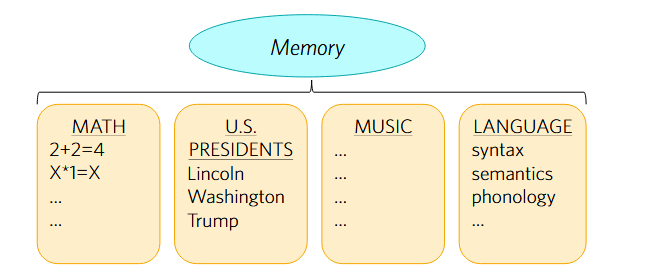
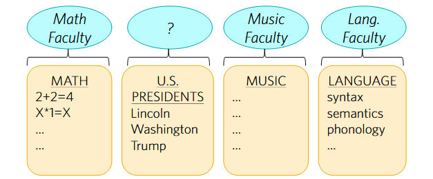

# Modularity of Mind
- Hugely influential to this day
- Tackles *one of the core questions* of Cog Sci: What is the structure of the mind???
- How does the mind actually **break down** into different components?
- Historical antecedent: *faculty psychology*

### Faculty Psychology
- How is it that humans judge things to be true or false??
- We have a "*faculty of judgment*."
- Often understood in terms of *power*.
- It has been judged to be trivial, and doesn't actually say much...
	- "Opium makes us sleep b.c it has a "soporific power"
	- Then, maybe its not true that the mind breaks down into parts...
- **Also unattractive**-- some difference between (e.g.) short-term + long-term memory.
	- (someone's Wi-Fi password vs. your own.)
- Ways of differentiating parts of the mind without faculties?
	- Fodor doesn't consider this idea...

#### Fodor
- We need a faculty psychology that is compatible with the idea that **cognition = computation**.
- For him, a *Classical architecture*.

### Mental Organs
- **Chomsky:** "Language faculty"
- When studying language, we're not really studying the language, but we're studying a particular *part of the mind*.
- Explains...
	- Why *only humans* have language. (We evolved a specific faculty for language that other animals have not.)
	- Why language is acquired *universally*. (Genetic endowment of the species.)

#### Grammar
- Internal representation of **rules** of language.
- Generate some structures but not others.
- "**Generative grammar**"
	- This is the background (core) of the research program known as **generative linguistics**.
	- Still the dominant paradigm in linguistics.
- Language faculty is a "mental organ" characterized by a grammar.

##### Universal Grammar
- Innate part of the language faculty that "maps a course of experience into particular grammar that constitutes the system of mature knowledge of a language."
- Often characterized as *what the child innately knows about language*.
- Relates to [poverty of the stimulus](1-what-is-cog-sci#the-poverty-of-the-stimulus).
- Might be other mental organs with other types of knowledge??? (Music, math, etc...)

### Neocartesian Faculties
- Fodor: Chomsky's mental organs are Neocartesian faculties.
- The language faculty is a *body of knowledge*, which represents rules.
	- Different bodies of knowledge for different domains/tasks.
- What's innate is a bunch of **possible grammars**.
- Plug in one course of experience -> English.
	- You learn language by pruning a "hypothesis", confirming and testing your hypotheses for what is correct and not.
	- You gain evidence by just watching and listening to people speak.
	- *Narrow down* which hypotheses are correct.
- **Fits with a computational account of cognition**
- Parsing a sentence = drawing an inference...
- Same would be true of **Acquiring a language**

### Organs as Mechanisms
- Cartesian Faculties (if they exist) can't be the whole story about the mind...
	- **Example:** Memory
- What propositional knowledge could allow you to remember that cats are mammals.

#### Memory
- Short-term memory limits ("[magic number 7](../cog-sci/8-memory)")
	- Outdated... 3 or 4 items, or none.
	- **You chunk the items into different chunks** and those chunks of 3-4 in length.
- **Fodor:** "There's a box in your head and when you try to put more than seven things in it, some of the things start to fall out."
- **Not a body of knowledge**, but a *mechanism*.

---

- **Mechanism** explain how representations interact + cause behavior.
	- Why do we go from "p" and "if p then q" to "q" 

#### Infinite Regress
- Lewis Carrol, "What the Tortoise Said to Achilles" (1895)
	- Achilles tries to prove a proposition with a logical argument. (1. p 2. if p then q; so q)
	- The tortoise asks why 1 and 2 entail q; there must be a hidden premise which says:
		- 3. if p and if p then q, then q.
	- But then the tortoise can ask why 1,2, and 3 entail q, there must be *another* hidden premise which says:
		- 4. if p and if p then q, and if p and if p then q, then q, then q.
	- And so on.

---

- Everybody should posit **some** innate mechanisms.
- **Empiricists**:
	- Would not posit a language organ or structured language rules...
	- **No innate content**, very *few* innate mechanisms.
		- Some ability to recognize patterns.
		- *Copy principle* (sense perception and copying it)
- **Rationalists**:
	- Some innate content, More innate mechanisms.

### Horizontal Faculties

1. Mechanisms (not knowledge)
2. Relatively small in number
3. General across content domains

### Vertical Faculties

1. Mechanisms (not knowledge)
2. Relatively large in number
3. Domain specific

> Not that you have some faculty of judgment or memory, but something like a "language faculty", a "math faculty", or a "music faculty"

- Not mere dispositions - psychologically real mechanisms.
	- You might have the mechanism (competence) but not be disposed to use it (performance)
	- *Performance error*, not a *competence error*

---

- **Gall:** People might have good memory for chess but not music, so there can't be one memory.
- **Fodor:** No bc. memory for chess/music could be an *interaction*
	- Memory + knowledge of domain + past experience.
- **Can't infer** from different *performance* to no shared *competence* (mechanism)

---

#### Innate + Neural Areas
- Gall's phrenology messed this up.
- He thought distinct neural areas were bigger/smaller corresponding to aptitude.
	- Thought you could *feel* corresponding bumps on the skull.
- Emphasis on aptitude + personal differences - philosophically confused, morally questionable.

### Computational Autonomy
- Vertical faculties should be "**computationally autonomous**"
- *Core Idea:* Two mechanisms are autonomous if they don't compete for resources.
	- Spell a word in your head while counting to ten.
	- Now spell a word while tapping your finger...
- **Not entailed by Neocartesian faculties**
	- Distinct bodies of knowledge might share common mechanisms/resources.
	- Does autonomy entail innateness?

#### Input Systems
- Turing machine = stand-in for cognition.
- Symbols written down in memory, mechanisms that use rules to transform them...
	- If `p` then `q`; `p→q`
- For biological organisms, at best *incomplete.*

##### Subsidiary Systems
- We need "subsidiary systems"

## Domain Specificity

### Mandatoriness
- Input systems are not under "executive control."
- You can choose what to think about.

##### Stroop Task
- The *Stroop Effect* - 
	- Say the color of the font
- You *Just cant help processing it*
- **Lexical identification** is mandatory (or "automatic")

##### Caveats
1. Attention

- If you are absorbed in some task, you may fail to parse what someone says.
	- Fodor: this minimizes the *input* to the parser, or the extend to which the *output* is cognized.
	- The operation of the parser (transforming inputs into outputs) is *still mandatory*
- **Covert Attention** vs **Overt Attention**
	- You can do this with your senses.

1. Re-interpretation

- Paints (or experts) might be able "see" the 2D projection of 3D objects.
	- Fodor: This is a post-module re-interpretation of the output, not an effect on processing within the module.

---

- **Mandatory=** Hold fixed the input (e.g. don't shut your eyes, stop up ears, etc...), and you will always get the output.
- "Think of an utterance of 'All Gaul is divided into three parts' as an acoustic object. Now try hearing an utterance of 'All Gaul is divided into three parts' as an acoustic object. Notice the difference."
- Potential counterexample: Semantic satiation.
	- Words start to lose meaning and you stop processing the meaning when you repeat it.

### Information Encapsulation

- 1940s/50s: "New look" psychology.
- Perception is driven by expectations & values.
- People slower/less accurate at recognizing the color of a playing card if it doesn't match the suit.
	- A black heart.

#### "New Look"
- How does perception having access to your expectations (playing cards) & values (coins) square with speed and manditoriness of perception?
- Fodor: We don't want input systems to have access to *all of your expectations and values.*
	- *Encapsulation*
		- They only have access to *proprietary store of information*.
			- Specialized information, does **not** include all your background knowledge, feelings, etc...
		- Example: Light from above prior
- Quicker to avoid having to sift through all that background info.

---

- Starkest examples: *illusions*
	- Muller-Lyer Pulsating Star
- McGurk effect keeps working even after you know he's saying "ba"

---

#### Carpentered World
- One hypothesis is the "carpentered world hypothesis"
- Longer lines look further away because of corners constructed in certain cultural environments.
- However, blind children who have cataracts removed are *immediately susceptible*.

---

*Instead,* informational encapsulation seems to rely on info about length cues that is **innately available to vision.**

- Remains impossible to "unsee"
- Vision is to some degree *insensitive* to expectations/beliefs...
- "Cognitively impenetrable"

#### Why Encapsulation
- **Fodor:** The *point* of perception is to contradict belief.
- You don't want it to tell you what you expect to be out there.
- You want it to tell you what is out there, even if it doesn't align with your expectations.
- **It explains why input systems are fast**
- Can simply ignore most of the info stored in the mind.
	- No need to search through all of your knowledge to see what's relevant.
- Input systems just make assumptions that are reliable. (Light from above prior)

##### Caveat (a)
- "The information that input systems provide must somehow be reconciled with background knowledge."
	- Even if it doesn't access the background knowledge.
- You don't end up thinking that the lines to the right are equally long.
- But this is something that happens cognitively -- input systems say their piece + you sort out what's true.

##### Caveat (b)
- "Evidence for the cognitive penetrability "
- Multiple systems might perform the same function.
	- Fodor: What word comes next in "I have the pepper, but please pass the ..."
- If the signal is degraded (can't hear it well), people will understand the sentence better if it ends with "salt" than if it ends with "dog"

##### Caveat (c)
- There can be "top-down" information flow *within* input systems without violating encapsulation.
	- Fodor's example: If the 's' in 'legislation' is replaced with a cough, people still hear the 's'

### Wishful Thinking
- Recall the "New Look": Perception driven by expectations and values.
- Balcetis & Dunning (2010) are an example of the revival of this perspective.
	- Their Question: does visual perception of distance have access to our desires.
- Encapsulation *says* that this should NOT ever happen.

---

##### Experiment 1
- Will thirst affect perception of how far away bottle of water is?
	- n=47.
	- Some Ss drink water (quenched) others each salty pretzels (thirsty)
	- Sit across from full bottle of water 36 in. away - rate desirability and verbally estimate distance.
- **Result:**
	- Thirsty Ss rated water as more desirable than quenched (p<0.001)
	- Thirsty Ss also estimated that the bottle was ~10% *closer* (25.1 in vs 28.0 in) (`p=0.05`)

---

- Does the nonverbal DV (dependent variable) really eliminate the possibility of the effect as being post-perceptual?
	- Example: Suppose I tell you before the study that I'll give you \$20 if you underthrow the beanbag.
	- Does you underthrowing the beanbag show anything about your visual perception?

---

##### The New "New Look"

- Lots of effects have been reported in the past ~20 years purporting to show "top-down effects" (i.e., effects of cognition on perception)

### Categorization & Language
- "It has been reported that *learning color-letter associations biases perceptual judgment*toward the learned hues; categorizing faces as Black or White alters the faces' perceived skin tones, even when the faces are in fact equally luminant; and knowledge of an object's typical color (e.g. that bananas are yellow) makes grayscale images of those objects appear tinged with their typical color." 

#### Task Demands & Response Bias

- Gilchrist argues that many of these results are sensitive to *task demands*.
- Task demands are essentially features of the experiment that lead Ss to *guess what you hope/expect they'll do...*
	- No control for test demands in these experiments.
- People like to please, so they may adjust performance to fit task demands.

> **Task Demand Effect:** Guessing what the experimenter is asking of you for the experiment.

##### Task Demands

- Does your self-esteem affect how far away you perceive a threatening object as being?
- Harber et al. (2011) had people recall a time they'd helped a friend (pos.), a time they'd betrayed a friend (neg.), or a time they'd done laundry (neutral).
- Then, they estimated their distance to a tarantula, and estimation varied with self-worth condition.
	- Neutral self worth they perceived as a baseline of 4.
	- If negative, they perceived the object to be much closer.
- Does this show a top-down effect of self-worth on vision?

---

- Bhalla & Proffitt (1999) found that people report steeper slopes when wearing a backpack.
- Could this be a demand effect?
- Involves a "*very conspicuous manipulation*" (a curiously unexplained backpack)
- Ss weren't asked what the backpack was for, and was not given a cover story.

##### Ruling out Task Demands
- What could you do to rule out *task demands* as the cause of this effect?
	- What if you *asked them ....*
- **Follow up study**
	- Durgin et al. (2009) gave Ss a cover story.
	- Told that the backpack was to hold heavy equipment that monitored climbing.
	- "The effect of heavy backpacks on slant estimation **completely disappeared!**"
	- Use of a cover story only affects task demands, not visual perception-- effect can not be on visual perception.
- Controlling demand effects need not require an explicit cover story.
	- *Only required for manipulations that are **obvious***

### Outputs of Modules
- **Fodor in Part 2:** "Format constraint" on input systems.
- "The function of these subsidiary systems is to provide the central machine with info about the world; info expressed by mental symbols in whatever format cognitive processes demand of the representation they apply to." (*Format constraints*)
	- So, if we *think* in a Language of Thought, then the output of each module that is fed into central cognition should be LoT sentences.

###### Cont.

- But which properties of the world do modules represent?
- Maybe it's unlikely that your visual system can represent something as being 57 *times smaller than the Empire State Building*.

#### Mandelbaum
- Perceptual systems should **categorize** stimuli.
- Instead of just representing *visual* features (color, shape, motion, etc...) it would be useful for your visual system to identify what *kind of thing* you're looking at.
##### Problem
- What categories?
- You could categorize a banana as a *yellow thing*, or *fruit*, or *bananas*, or etc....
- Mandelbaum appeals to the idea of *basic-level* categorization.
	- **These** are categories that are not too abstract or too specific.
	- Informative without giving unnecessary details.

### Perception + Categorization

Mandelbaum's argument for perceptual categorization is based on *speed*....

- The categorization is happening so fast its too quick for central cognition to get involved.

**Example:** Rapid Serial Visual perception:

- People are **above chance** at saying whether a certain object was present even with 12 images presented at 13 ms each.
- Each image is immediately *masked* by the image following it.

> "Masking normally ensures that the processing of the stimulus has to be stopped because the next stimulus is already appearing to be processed."

- They are then asked: Was there a dog?
	- People are *above chance* at saying whether a certain object was present even with 12 images presented at 13 ms each.
	- *Mendelbaum* says that you are **categorizing the stimulus.**
		- Masking disrupts the processing of the stimulus.
		- **You automatically extract the average of large sets.**

#### Is it Really Perception
- Mendelbaum: Yes, because it happens too quickly for central cognition to be involved.
- It does not get the the cognitive systems in time.
- "Reentrant loops in the visual system are estimated to take at least 50 ms to make a round trip... that is for reentrant loops within vision, nevermind central cognition."
	- There's no way for cognition to be involved in something happening in 13 ms.
- So, *if there's no time* for cognition, how are you able to categorize?
	- There may be a super fast (modular) processing that starts immediately upon the correct input.
		- Modular perception.
	- Another argument: If categorization always happens *no later* than other outputs of perception... categorization happens after perception. (not within)

#### Grill-Spector & Kanwisher (2005)
- Showed Ss images + masked them after 17 ms.
- Images either contained an object (e.g. dog) or a non-object (e.g. scrambled image)

1. Detection (was there an object?)
2. Categorization (was there a dog?)
3. Identification (was there a german shepard?)

##### Result
- In the short durations.... **identification was impaired**.
- However, the time for detection and categorization is the same as one another.

> There is no **gap** in speed between perceiving the object is present and categorizing it at the *basic level.* (No diff in accuracy.)

---

To sum it up: Mandelbaum argues that categorization happens *too quickly* to involve cognition.

- That means perceptual processes need to have access to basic-level categories.
- He argues that this fits with a modular view of perception.
- Categorization at other levels (*mammal* or *German Shepard*) is due to unencapsulated cognition.

---
