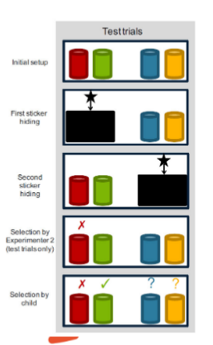
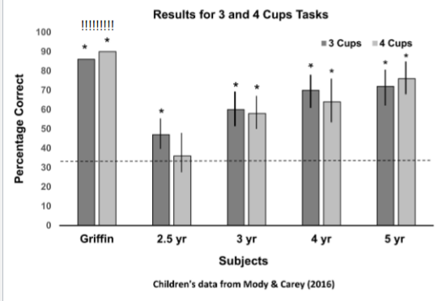

# Non-standard Minds

#todo get what im missing
### The Imitation Game
- An interrogator asks a series of questions, and receives printed out answers.
- The task: tell if the answers are produced by a human or a machine.
- *Is* the Turing Test a plausible measure of intelligence?

### The Chinese Room
- Searle argues that passing the Turing Test is *not* sufficient for intelligence.
- Strings of Mandarin come in, you look them up on a table, and send the right strings back out.
- You don't understand Mandarin at all - but could you fool someone this way?

## Logical Reasoning

## Baby Logic

### Developing Cognition

- M&C argue the 2-cup task doesn't necessarily require disjunctive syllogism.
- Call's interpretation: 1 or 2; Not 1; Therefore 2.
- M&C's alternative: maybe 1, maybe 2; Not 1; Maybe 2.

---

- Imagine a chalkboard in your mind where you represent possibilities about where food is.
	- Write down: *Could be in 1*; *Could be in 2*
	- Hear 1 shake, no sound, so wipe 1 off the chalkboard.
	- All you're left with is *could be in 2*, so you go to 2.
- Doesn't require logical operators like 'or'
	- We need a task that distinguishes the chalkboard from real disjunctive syllogism.

---

- Even simpler possibility: Use "avoid empty rule"
- Don't even ned to keep track of the number of objects + possible locations.
- (What should Kibbie & Leslie make us think of this?)

### Four Cup Task

- M&C developed the "four-cup task" to distinguish genuine disjunctive syllogism from merely updating possibilities (e.g. on a mental chalkboard)
- Two stickers, two pairs of buckets/cups.
- Shown one of the four buckets is empty.
- Pick a bucket to find a sticker.

- How would you solve this with logical reasoning?
	- A or B, C or D; Not-A, therefore, B.
- What if you're updating possibilities on a mental chalkboard?
	- Maybe A, Maybe B, Maybe C, Maybe D; erase A; Maybe B, Maybe C, Maybe D.
- Children who are merely updating possibilities should be *just as likely* to go to any of the three other cups after seeing Cup A is empty.
- Children who perform disjunctive syllogism should be able to go right to Cup B.

#### Results

- Training trails: all ages chose the target cup above chance. (33%)
	- 2.5y/o: 47%
	- 3y/o: 58%
	- 4y/o: 71%
	- 5y/o: 72%
- Test trials: 2.5y/os failed the task!
- **Overall:**
	- Main effect of age, older kids did better across the board.
	- No effect of trial type.
	- No interaction between age and trial type.

#### Why?

- Why are 2.5y/os failing? Do they lack logical reasoning abilities?
- One possibility: Logical reasoning requires *linguistic tools* that they haven't acquired yet.
- M&C: "Although children productively use the word ‘and’ in language shortly after their second birthday, they do not say the word ‘or’ until about 3 years of age. ...This might hint that the logical relation OR is not a part of infants’ conceptual repertoire. This hypothesis, if supported by further research, would be consistent with proposals that language acquisition plays a crucial role in the development of logical capacities.” (p.47)
	- Plausible?

#### Parrot

- Pepperberg et al. (2018) trained Griffin, a 20y/o Grey parrot, to look for Skittles in metal cups.
- After training, they used the Skittles to run the 4-cup task.

- How is it possible that Griffin succeeded where 2.5 y/os failed? (and did better than the 4-5 y/os!)
- Language?
	- "Griffin, although trained to use English speech to identify objects, colors, shapes, and to make some requests, know no words for any logical connectives..."
	- Unclear how language could help w/o terms for "or", "not"

