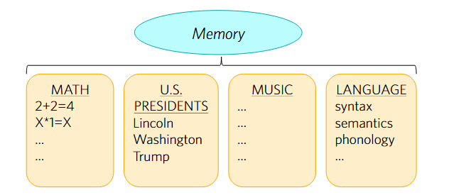

# Midterm Exam 2

- **Important**: Mendelbaum argument about speed of perception may be on exam!
- What Manditoriness is, and an example of it.
	- Stroop task.
- **Notion of domain specificity**

## Horizontal and Vertical Faculties

- Know what are horizontal faculties.
	- **Important**: Explain what a horizontal faculty is and give an example!
- Vertical faculties get replaced by modules.
	- Large in number, and domain specific.

#### Horizontal Faculties

1. Mechanisms (not knowledge)
2. Relatively small in number
3. General across content domains

## Modular Input Systems

- You have a central processing unit (central cognition)
- Input systems that feed information into central cognition.

### Format Constraint

- The modules must output the information in a certain format.
- **Example**: if central cognition processes via LoT, all the input systems needs to be in that LoT format.

## Modules

### Properties of Modules

#### Domain Specificity

- Only processes certain inputs.
- **Basic-level categorization** is an example.
- Face perception and the "inversion effect"
	- **Obama**
	- Effect is species dependent.
		- Chimps show a stronger inversion effect than humans.

##### Two properties

- **Input Condition:** Only a very specific class of representations can be inputs to the module.
- **Computational Condition:** The computation being performed is specialized to a very specific *task*.

#### Mandatoriness

- Input systems are not under "executive control."
- You can choose what to think about.
- Whether you like to or not, you **will** parse a sentence or see what's in front of you.

##### Two Caveats

- **Attention:** Being too absorbed in a task (game) and you may fail to parse what someone says.
	- Me getting distracted when someone is talking to me frfr..
- **Re-interpretation:** Forcefully overwriting the Mandatoriness through training.
	- However, *Fodor* says this is a post-module re-interpretation of the output, not an effect on processing within the module.
##### Stroop Task
- The *Stroop Effect* - 
	- Say the color of the font
- You *Just cant help processing it*
- **Lexical identification** is mandatory (or "automatic")

- Implicit bias:
	- Men and Science, Women and art vs Men and art, women and science.
		- Slowed down men its the latter. Some form of association there.

#### Encapsulation

- It has a limited store of information that it has access to.
	- Does not include things like beliefs and desires.
- Encapsulation explains why seeing is faster than thinking.
	- If you have a system that is encapsulated, processing with a limited amount of info is *quicker* because there is less to work through.
- **Example:**
	- Light from above.
		- Chickens that were raised only with light from below can't update the prior.
	- Optical illusions.
		- Even once you know how the illusion knows, the illusory effect is still present.
- Also why Balcetis and Dunning reported against Encapsulation. (Goes against what they were showing with their experiment.)
## Balcetis & Dunning

- Opponents of modularity.
### Wishful Seeing

- Perception has access to your desires.
- Study about water bottles and drinking water before vs eating something that makes you thirsty.
## Gilchrist

- Argues against Balcetis & Dunning, and says perception *is* modular.
- There are other explanations for the effects of *Wishful Thinking*.

### Task Demands

- Experimental subordination. (You want to do what is expected of you for the experiment.)
- You want perception to function like a free press.
	- *Immune from influence*
	- Perception *needs to be* free from cognitive influence because it needs to be a free source that is independent from a cognition telling you what to report.
		- Central cognition is like the central government.
	- It's useful to be able to be told you are wrong.
	- **Important:** May have to explain the analogy.

## Mandelbaum

