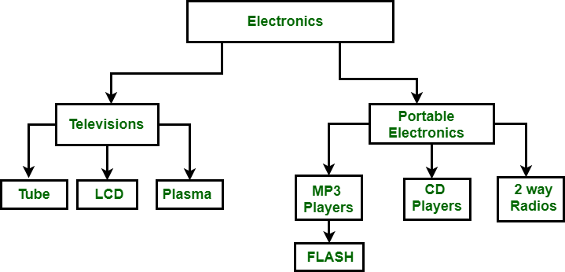
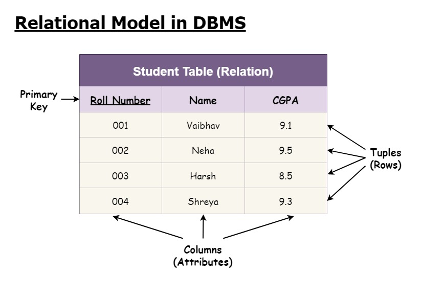
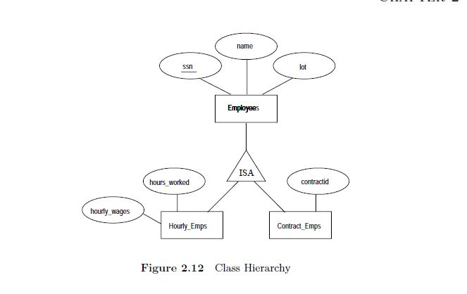
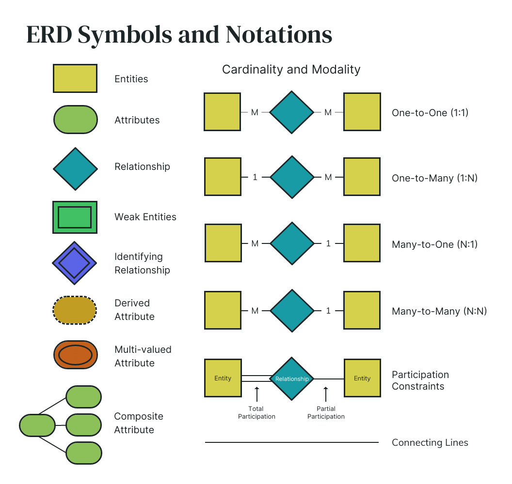

# Principles of Information and Data Management

## DBMS

> Database Management System

### Types of DBMS

#### Hierarchical

> Created in the 1960s



- Top levels are large categories for the lower levels.
- An example would be A hierarchical organization of Country -> States -> Counties -> Towns
- Nodes, each with only one parent.
- It uses pointers (references)

##### Use Cases

- File systems
- GIS


#### Network (Graphs)

> Created in 1970s

- Finding and following links (pointers)

#### Relational Model



> Created in 1970s by Ted Codd.

- Relational calculus and Relational algebra
- At the time of development, it was a theoretical model, but not widely used until the 1980s.
- The data is stored as tables, each of which can make references to other tables.
- Needed a way to find by contents:
	- *QUEL* (Query Language)
- New version (`SEQUEL`) haha funny. However, they couldn't call it that because copyright or smth.
	- *SQL* (Structured Query Language)

##### SQL

> **SQL is not a programming language!!!** It is a *query language*.

- There are multiple implementations of SQL.
	- Oracle
	- MySQL
	- PostgreSQL
	- SQL Server
	- and more...
- There are many different things in standard programming languages that are not in SQL.
	- Loops
	- Variables

#### Object Oriented Model

- Objects, each one includes methods.
- There has been an effort to change the OOM to relational database, but there is a bit of a mismatch.
	- Files that have been developed in order to bridge this gap. (JSON, XML)
		- These files have been used for *NoSQL* databases. (MongoDB uses JSON)
			- NoSQL allows for some more ambiguous data.
		- These files were later used by Javascript to store objects.


### Conceptual Design

#### Entity-Relationship Diagrams (ER Diagrams)
- **Chen notation** (Argued to be the first ER Diagram)
	- A little counterintuitive.
- **Arrow Notation** (We will primarily be using this one.)
- **Crow-foot**
- **Cardinality Notation** (And maybe also this one.)

> All of these are used to represent the same thing.

- ER Diagrams contain:
	- Entity Set - Group together similar elements in a *set*. (No dupes)
		- Each element is going to have a bunch of *attributes*.
		- A *multivalue attribute* is an attribute that can have multiple different values.
		- Entity sets **must have** a primary key.
	- **Minimal** means I can not remove any field to uniquely identify an entry. (Doesn't have to be the shortest one.)

#todo get the image hopefully he posts the notes.

##### Candidate Keys

- Minimal set of attributes that uniquely identify an element.
- There can be many of these.

##### Primary Keys

- A candidate key that will be *enforced* by the DBMS. (Fully unique key)

## SQL

### Domain Constraints

> The different types in SQL.

- `int`, `float`, `double`, `boolean`, `date`, `datetime`, `time`
- **String types:**
	- `char(10)` - String of fixed length = 10
	- `varchar(10)` - Variable length <= 10

### Arrow Notation

- `->` - Arrow means at most one relation.
- `⮕` - Thick arrow means *exactly one*.
- `--` - Thick line means *at least one*.

### Participation Constraint

- Partial
- Total
	- A Total participation constraint means every entity set *must* appear in the relationship. (At least once)
	- It is represented in the ER as a **thick** line.

##### Example

```
Employees work for departments
Some employees are managers of a Department
```


---

### Cardinality Notation

- Arrow notation only represents things that have to do with 1.
- You only use it when needed.
- This can be mixed with arrow notation if needed.
- It looks very similar to arrow notation, just with a label on each of the lines to say a range like: `0...1` (0 to 1), `1...30` (1 to 30)

---

#### Redundancy

- You don't really want redundancy in a database so you want to reduce it as much as possible.
- For example, if you want to link employees to managers (who are still also employees), you can use a *reflexive* relationship.


> [!NOTE] Reflexive Relationship
> Allows for a circular linkage.


## ISA Relationships

> Subsets that inherit attributes.



> This ISA relationship is *disjoint* and *complete*.


### Constraints
- *Covering*
	- Complete vs partial
- Overlap constraint
	- This can be either disjoint or overlapping.


> [!NOTE] Weak Entity Sets
> - Do not have their own primary keys.
> - Take these keys from another entity set through identifying relationships.
> - might have partial keys.



---

**Note:** You can *mix and max notations for cardinality when needed*

---

### Aggregation

```
theres a student teacher er diagram connected by a "teaches" relationship
there is a principal that supervises the teaching by the student and the teacher.
make a aggregation rectangle (dotted rectangle) around the relationship, and then you can connect the principle to the "fake entity"
```

- You can't connect a relationship to another relationship.
- *So*, we use aggregation to change the *teaches* relationship to a entity set, allowing us to connect it to the principle *supervises* relationship.

**Instead of using aggregation, you can also transform the relationship diagram into a weak entity set.**

#### Design Considerations

- **When to use attributes vs entity-sets**
	- *Ex:* Employees that have (`eid`, `name`, `phones`- multivalue (so double circle))
		- However, you can also make this into a entity-set with phone as it's own entity and connect it with a relationship.
		- #todo get the image.
		- Then say you don't want an attribute called `type`, you can then connect `phones` entity to another entity called `phoneTypes`.
- **Attributes vs relationship**
	- *Ex:* Employee with attributes `id`, `name`, `manager`
		- Or, replace it with a relationship, make it *reflexive*.
		- *Either option works*, just depends on what you need it for.


### Hierarchy

> **Inheritance!!!** Each of the elements lower will *inherit the attributes* of those higher up!

- Library
	- Books!
		- Books have an author, title, date written, etc...
		- **Book edition**: *Publisher*, edition number.... blah blah blah.
		- **Book copy**: To keep track of the copies. (Inherits the book edition and other info!)
		- (*Note:* You wouldn't be able to use IsA relationships for this one...)

#todo get the book edition thingy ER diagram.

> Manifestation: Chain of weak entity sets that *inherit* from each other.

#### Example

```
Design a Database for census information
	- Population
	- Countries, states, counties, towns
	  | Capital
	  | Name 
```


## [Exam 1 Guide](exam-1-guide)

