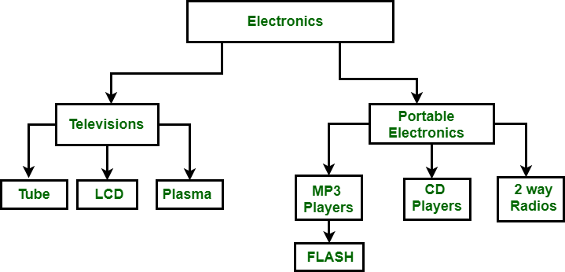

# Principles of Information and Data Management

## DBMS

> Database Management System

### Types of DBMS

#### Hierarchical

> Created in the 1960s

- Top levels are large categories for the lower levels.
- An example would be A hierarchical organization of Country -> States -> Counties -> Towns
- Nodes, each with only one parent.
- It uses pointers (references)

##### Use Cases

- File systems
- GIS

#### Network (Graphs)

> Created in 1970s

- Finding and following links (pointers)

#### Relational Model

> Created in 1970s by Ted Codd.

- Relational calculus and Relational algebra
- At the time of development, it was a theoretical model, but not widely used until the 1980s.
- The data is stored as tables, each of which can make references to other tables.
- Needed a way to find by contents:
	- *QUEL* (Query Language)
- New version (`SEQUEL`) haha funny. However, they couldn't call it that because copyright or smth.
	- *SQL* (Structured Query Language)

##### SQL

> **SQL is not a programming language!!!** It is a *query language*.

- There are multiple implementations of SQL.
	- Oracle
	- MySQL
	- PostgreSQL
	- SQL Server
	- and more...
- There are many different things in standard programming languages that are not in SQL.
	- Loops
	- Variables

#### Object Oriented Model

- Objects, each one includes methods.
- There has been an effort to change the OOM to relational database, but there is a bit of a mismatch.
	- Files that have been developed in order to bridge this gap. (JSON, XML)
		- These files have been used for *NoSQL* databases. (MongoDB uses JSON)
			- NoSQL allows for some more ambiguous data.
		- These files were later used by Javascript to store objects.

### Conceptual Design

#### Entity-Relationship Diagrams (ER Diagrams)
- **Chen notation** (Argued to be the first ER Diagram)
	- A little counterintuitive.
- **Arrow Notation** (We will primarily be using this one.)
- **Crow-foot**
- **Cardinality Notation** (And maybe also this one.)

> All of these are used to represent the same thing.

- ER Diagrams contain:
	- Entity Set - Group together similar elements in a *set*. (No dupes)

