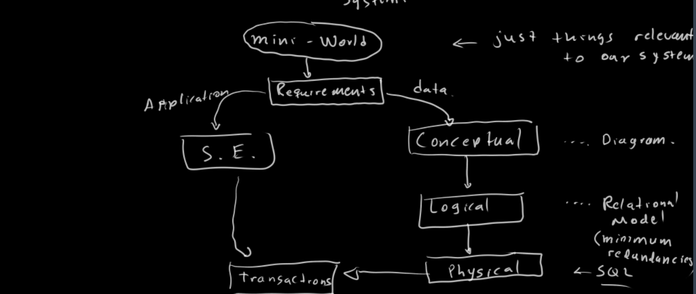
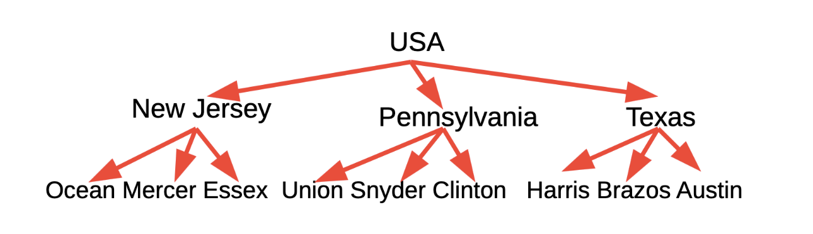
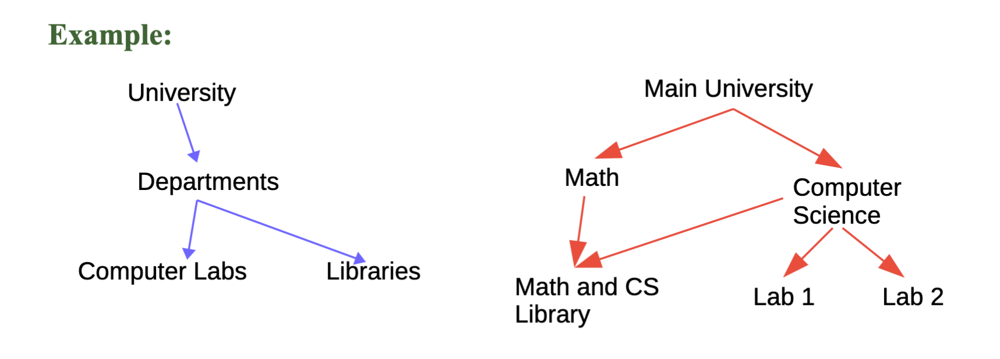
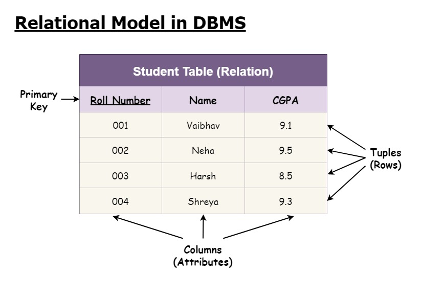
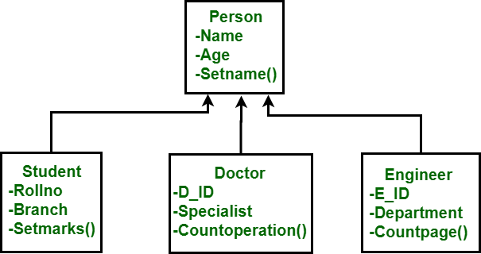
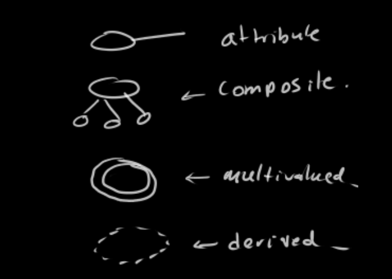
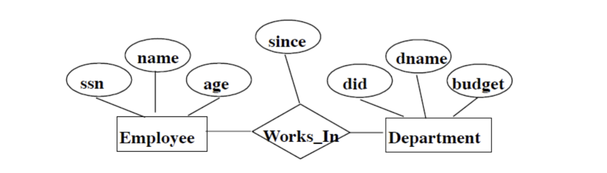
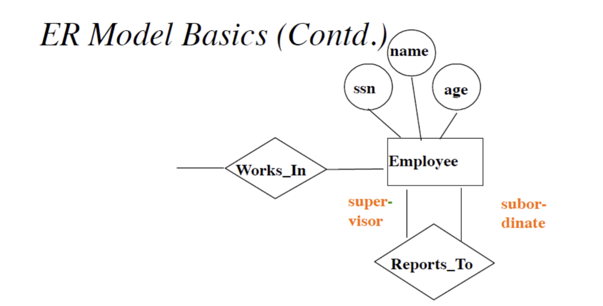

# Exam 1 Study Guide

## Concepts

- Data: Facts, products of observation in the world. Data is information in its raw form.
- Information: Information is how data is interpreted. *Data becomes information* based on answers to a *specific question*.
- Mini World: Because there is **so much data in the world**, we can not capture all of the data in it, so we restrict the domain of the data. 
	- This data can be:
		- Used directly
		- Through a system (Information system)
- Information System Design:
	- 
- Data Storage:
	- There are two different ways to store data in files..
		- **Sequentially:** Each block is right after the next, meaning you would have to read through each one to find the one you're looking for.
		- **Random access:** Efficient algorithm for insertion, deletion and searching.
- Concurrency: How do we ensure that multiple people are able to access the data and modify it without leading to any issues?
- DBMS: The Database Management System (DBMS) is a system designed to:
	- Take care of concurrency issues.
	- Store data in a way such that the user doesn't have to know where or how the data is being stored.
	- Provide efficient algorithms for insertion, deletion and searching.
	- Generalized so it's easy to define the structure of the data.
	- Should be reliable.
	- Should not have limits on the amount of data stored.
	- **All in all, it is an efficient, convenient and safe multi-user storage of and access to a massive amount of persistent data.**

## Types of Database Models

### Hierarchical

> The Hierarchical model for databases looks a little bit like a tree design with each node having just one parent. (1960s)

- These models are still used to this day in file systems and GIS systems.

### Network Model

> Looks very similar to the hierarchical model, except each child could have multiple parent nodes that point to it. (1970s)

- You would search by following pointers, which meant that insertions, deletions and updates would take *a lot* of pointer operations.

### Relational Model

> Searching by **content**, not by following links or pointers. It relies on a structure known as **Relational Tables**. (1970)

- There are many such relational databases out there including: MySQL, Oracle, SQL Server, DB2, etc...

### Object Oriented Model

> Store data in *objects*, similar to the OO programming languages that were coming out at the time. (1990s)

- Lots of issues with communicating OO apps with databases in relational models. 
- Led to the creation of Post-relational **No-SQL** content...
	- XML, JSON (Mongo uses JSON), Ajax

## Entity Relationship Diagrams

### Concepts

- *Entity Set*: A collection of similar individual things...
	- **Think about it like a *class* in OOP.**
- *Attribute:* A simple value that is associated with an entity, usually helping to describe it.
	- **All entities in an entity set have the same set of attributes.**
	- Each of them have a specific *domain*...
		- Type: `int`, `bool`, `float`, `string`, `date`, etc...
	- Each of these attributes could also be **composite** (made up of multiple other attributes) or **multi-value** (have multiple different values).
	- Attributes *may also be derived*, meaning their value comes from another attribute.

> The following image describes how each of these look in the ER Diagram.

### Relationship Sets

> Set of specific relationships/tuples between individuals in the entity linked to it. (e.g. Mary works in the sales department)

**Relationship set attributes**: Specific attributes that apply to the relationship to help qualify the nature of the relationship.

- In this example, the `since` field is the relationship set attribute to help quantify the time the employee has worked in a certain department.

> Relationships do not need to be between two different entities. They can link to itself in something called a **reflexive relationship.**

- In the case above, the employee may also be a manager that has employees reporting to him/her. 

### Constraints

- **Candidate keys:** Minimal set of attributes that uniquely identify an element. (There can be many candidate keys in a *entity*)

### Notations

#### Chen Notation

#### Arrow Notation

#### Crow-Foot

#### Cardinality

