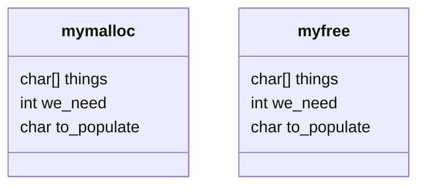

# [My Little Malloc](sys-prog)

Creation of a `mymalloc()` library for Rutgers University class: `01:198:214` - Systems Programming

Created by: **Emily Cao** (ec1042) and **Ivan Zheng** (iz60)



## Errors to Detect

1. Attempting to `malloc()` too much memory.
	- Return where the error occurred and how much they tried to allocate (_Attempt to allocate BYTE_SIZE from Line LINE_NUM_)
2. Attempt to `malloc()` more memory than is currently available.
	- Error occurs when allocating more memory that may not be available in a row.
3. Attempt to free an address outside the heap.
	- Return the memory address ex: trying to free a local variable.
4. Attempt to free an address of a non-allocated objected. (Already freed object)
5. Atempt to free an address in the heap but not of an object.
	- Ex: having an array in the heap but trying to free just the 2nd object in the heap.

---

## Important Variables

```C
#define MEMLENGTH 512
static double memory[MEMLENGTH];	// Usage of "static" makes the array private to this file.
// That is, it doesn't participate in linking
// We use "double" because it is 8-bytes and has 8-byte alignment.
```

## Steps

- Memory should be a single free block.
- When you get a call to `malloc()`, you should look through the memory and look for a portion of free blocks the object can fit into.
- As `malloc()` proceeds, we keep dividing the memory up into more and more blocks. (Don't forget the metadata)
- **Make sure you know where the memory begins and how big it is.**
- **The free block also requires metadata**
- "Large enough" means that we also have space for a new metadata block!
- It's okay if malloc returns a region larger than requested, but malloc **cannot** return one smaller than requested.
- In order to make `free()` safe, you need to look at all the blocks anyways.
- **No global variables aside from the stuff in the header**

### Coalescing
- Combining adjacent free blocks to make a bigger free block.
- *Coalesce function* (Do it in free, so whenever you free a block, you know the block that comes before and the block that comes after. If they are both free, then coalesce.)

### Metadata
- Up to us
- **Minimal**: Flag that says allocated or not allocated and how big the block is

> *TODO:* Discuss what we want in the metadata.

## Questions to Consider

- The argument to free must always be the address of the start of a block.
	- Your free needs to detect incorrect pointers and report them
	- How could you check whether an address is valid?
- Your own implementations of malloc and free must be *memory*-safe and never go past the end of your array.
	- Do you need to explicitly indicate that some block is the last block?

> Easiest Way: Loop through all the blocks and see if any begin with the address that you were given.

- **Can not** have initialization function.

> Header is all zeroes, probably first time malloc has been called.

